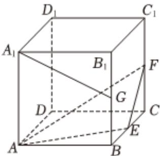

<!-- question-source:start -->
2、已知圆 $C_1:(x - 1)^2 +(y - 3)^2 = 11$ 与圆 $C_2:x^2 +y^2 +2x - 2my + m^2 -3 = 0$ ，则下列说法正确的是（）A若圆 $C_2$ 与 $\pmb{x}$ 轴相切，则 $m = 2$ B若 $m = -3$ ，则圆 $C_1$ 与圆 $C_2$ 相离C若圆 $C_1$ 与圆 $C_2$ 有公共弦，则公共弦所在的直线方程为 $4x + (6 - 2m)y + m^2 +2 = 0$ D直线 $kx - y - 2k + 1 = 0$ 与圆 $C_1$ 始终有两个交点

<!-- question-source:end -->

![[Q00090696A1]]
