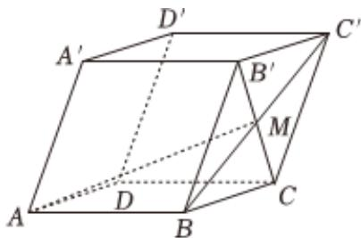

<!-- question-source:start -->
3、如图所示，在棱长均为2的平行六面体 $ABCD - A'B'C'D'$ 中，

$\angle A^{\prime}AB = \angle A^{\prime}AD = \angle BAD = 60^{\circ}$ ，点 $M$ 为 $BC^{\prime}$ 与 $B^{\prime}C$ 的交点，则 $AM$ 的长为

<!-- question-source:end -->

![[Q00090701A1]]
