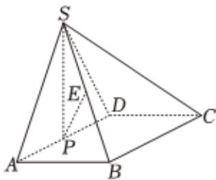

<!-- question-source:start -->
6、如图，在四棱锥 $S - ABCD$ 中，四边形ABCD是矩形， $\triangle SAD$ 是正三角形，且平面 $SAD \perp$ 平面

ABCD， $AB = 1$ ， $P$ 为棱 $AD$ 的中点，四棱锥 $S - ABCD$ 的体积为 $\frac{2\sqrt{3}}{3}$

1 若 $E$ 为棱 $BS$ 的中点，求证： $PE//$ 平面 $SCD$

2

在棱 $SA$ 上是否存在点 $M$ ，使得平面 $PBM$ 与平面 $SAD$ 的夹角的余弦值为 $\frac{\sqrt{21}}{7}$ ？若存在，指出点 $M$ 的位置并给以证明；若不存在，请说明理由
<!-- question-source:end -->

![[Q00090708A1]]
