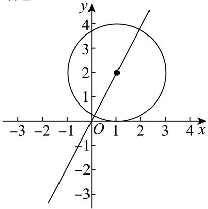

> [!faq]- 2024-2025学年内蒙古包头九中外国语学校高二（上）期中数学试卷解析
>
> > [!success]- **【答案】** C
>
> > [!note]- **【解析】**
> > 因为圆C与x轴相切，圆心在直线2x-y=0上，且经过点(1,0)，
> >
> > 所以设圆心坐标为 $(a, 2a)$
> >
> > 所以圆的方程为 $(x - a)^2 + (y - 2a)^2 = 4a^2$
> >
> > 因为点(1,0)在圆上，所以 $(1 - a)^2 + (0 - 2a)^2 = 4a^2$ ，解得 $a = 1$
> >
> > 所以圆 $C$ 的方程为： $(x - 1)^2 +(y - 2)^2 = 4.$
> >
> > 故选：C.
> >
> > 
