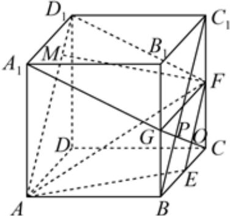

> [!faq]- 2024-2025学年内蒙古包头九中外国语学校高二（上）期中数学试卷解析
>
> > [!success]- **【答案】** BCD
>
> > [!note]- **【解析】**
> > 连接 $AD_{1}$ ， $FD_{1}$ ， $GF$ ， $BC_{1}$ ，设 $GC\cap BC_1 = P$ ， $GC\cap EF = O$ ，如图：
> >
> > 
> >
> > 对 $A$ ，根据 $BG / / CC_{1}$ ， $BG = \frac{1}{2} CC_{1}$ ，可得 $GP = \frac{1}{2} PC$
> >
> > 又 $EF$ 为 $\triangle BCC_{1}$ 中位线可得 $CO = \frac{1}{2} PC, GP = PO = CO,$
> >
> > 故 $GO = 2CO$ ，点 $C$ 与点 $G$ 到直线 $EF$ 的距离不相等，
> >
> > 故点 $C$ 与点 $G$ 到平面 $AEF$ 的距离也不相等，故 $\mathbf{A}$ 错误；
> >
> > 对 $B$ ，因为点 $\pmb{E}$ ， $F$ 是 $BC$ ， $CC_{1}$ 中点，则 $EF / / BC_{1}$ ，又 $AD_{1} / / BC_{1} / / EF$
> >
> > 连 $GF$ ，因为 $G$ 是棱 $BB_{1}$ 中点，所以 $GF / / B_1C_1 / / A_1D_1$ ，且 $GF = B_{1}C_{1} = A_{1}D_{1}$
> >
> > 所以四边形 $A_{1}GFD_{1}$ 是平行四边形，
> >
> > 所以 $A_{1}G / / D_{1}F$ ， $D_{1}F\subset$ 平面 $AEF$ ， $A_{1}G\notin$ 平面 $AEF$
> >
> > 所以 $A_{1}G / /$ 平面AEF，故B正确；
> >
> > 对 $C$ ，因为 $EF / / AD_{1}$ ， $A_{1}G / / D_{1}F$ ，则异面直线 $A_{1}G$ 与 $EF$ 所成角是 $\angle AD_1F$ 或其补角，
> >
> > 作 $FM \perp AD_{1}$ 于M，显然AE = D $_{1}$ F = $\sqrt{1^{2} + \left( \frac{1}{2} \right)^{2}} = \frac{\sqrt{5}}{2}$ ，
> >
> > 即四边形 $AEFD_{1}$ 是等腰梯形，
> >
> > $$
> > A D _ {1} = 2 E F = \sqrt {2}, D _ {1} M = \frac {A D _ {1} - E F}{2} = \frac {\sqrt {2}}{4}, c o s \angle A D _ {1} F = \frac {D _ {1} M}{D _ {1} F} = \frac {\frac {\sqrt {2}}{4}}{\frac {\sqrt {5}}{2}} = \frac {\sqrt {1 0}}{1 0},
> > $$
> >
> > 故C正确；
> >
> > 对 $D$ ， $FM = \sqrt{D_1F^2 - D_1M^2} = \sqrt{\left(\frac{\sqrt{5}}{2}\right)^2 - \left(\frac{\sqrt{2}}{4}\right)^2} = \frac{3}{4}\sqrt{2}$
> >
> > 平面AEF截正方体所得的截面是等腰梯形 $AEFD_{1}$ ，其面积
> >
> > $S = \frac{AD_1 + EF}{2} \cdot FM = \frac{2\sqrt{2} + \sqrt{2}}{4} \cdot \frac{3}{4}\sqrt{2} = \frac{9}{8}$ ，故 $D$ 正确.
> >
> > 故选：BCD.
