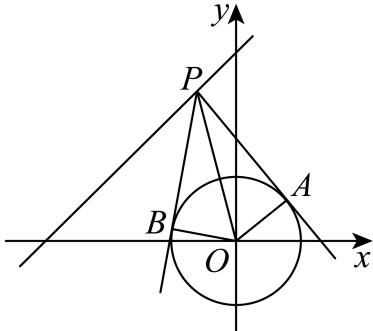

> [!faq]- 2024-2025学年内蒙古包头九中外国语学校高二（上）期中数学试卷解析
>
> > [!success]- **【答案】** ACD
>
> > [!note]- **【解析】**
> > 已知 $P$ 是直线 $l: y = x + 4$ 上的动点， $O$ 为坐标原点，过 $P$ 作圆 $O: x^2 + y^2 = 3$ 的两条切线，切点分别为 $A, B$ ，对于 $A$ 选项，设 $P(x, y)$ ， $|OP|^2 = x^2 + y^2 = x^2 + (x + 4)^2 = 2x^2 + 8x + 16 = 2(x + 2)^2 + 8$ 所以当 $x = -2$ ，即 $P(-2, -2)$ 时， $|OP|$ 取得最小值 $2\sqrt{2}$ ，故 $A$ 选项正确；
> >
> > 对于 $B$ 选项，如下图所示：
> >
> > 
> >
> > 连接AO、BO，则 $AO\perp PA$ ， $BO\perp PB$ ，由切线长定理可得 $|PA|=|PB|$ ，因为 $|AO|=|BO|$ ， $|PA|=|PB|$ ， $|PO|=|PO|$ ，则 $\triangle PAO\cong\triangle PBO$ ，所以 $\angle APO = \angle BPO$ ，且 $sin\angle APO = \frac{|AO|}{|PO|} = \frac{\sqrt{3}}{|PO|}\leq \frac{\sqrt{3}}{2\sqrt{2}} = \frac{\sqrt{6}}{4}$
> >
> > 由图可知， $\angle APO$ 为锐角，当且仅当 $PO \perp l$ 时，等号成立，
> >
> > 故 $cos\angle APB = cos2\angle APO = 1 - 2sin^2\angle APO \geq 1 - 2 \times \frac{3}{8} = \frac{1}{4}$ ，无最大值，故 $B$ 选项错误；
> >
> > 对于 $C$ 选项，设 $P(a,b)$ ，则以 $OP$ 为直径的圆的方程为 $x^{2} + y^{2} - ax - by = 0$
> >
> > 又圆 $O$ 的方程为 $x^{2} + y^{2} = 3$ ，两圆相减得直线 $AB$ 的方程为 $ax + by = 3$
> >
> > 故当点P的坐标为 $(-2,2)$ 时，直线AB的方程为 $ax+by=3$ ，
> >
> > 直线 $AB$ 的方程为 $-2x + 2y - 3 = 0$ ，点 $(- \frac{1}{2}, 1)$ 满足 $-2 \times (-\frac{1}{2}) + 2 \times 1 - 3 = 0$
> >
> > 所以直线 $AB$ 经过点 $\left(-\frac{1}{2}, 1\right)$ ，故 $C$ 选项正确；
> >
> > $$
> > x - 3 y + 3 = 0
> > $$
> >
> > $$
> > (- 1, 3)
> > $$
> >
> > $$
> > a x + b y = 3 \text {知}
> > $$
> >
> > 故选：ACD.
