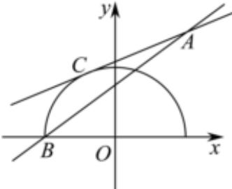

> [!faq]- 2024-2025学年内蒙古包头九中外国语学校高二（上）期中数学试卷解析
>
> > [!success]- **【答案】** $\left(\frac{5}{12},\frac{3}{4}\right]$
>
> > [!note]- **【解析】**
> > 直线 $l: kx - y - 2k + 3 = 0 \Rightarrow k(x - 2) - (y - 3) = 0$ ，即 $l$ 过定点 $A(2,3)$ ，
> >
> > $y = \sqrt{4 - x^2} \Rightarrow x^2 + y^2 = 4 (y \geqslant 0)$ ，即曲线 $y = \sqrt{4 - x^2}$ 为原点为圆心，2为半径的半圆，如图所示，设 $l: kx - y - 2k + 3 = 0$ 与曲线 $y = \sqrt{4 - x^2}$ 切于点 $C$ ，曲线 $y = \sqrt{4 - x^2}$ 与横轴负半轴交于点 $B$ ，
> >
> > 
> >
> > 则 $k_{AB}=\frac{3-0}{2-(-2)}=\frac{3}{4},\frac{|3-2k|}{\sqrt{k^{2}+1}}=2\Rightarrow k=\frac{5}{12}$ ，故 $k\in(\frac{5}{12},\frac{3}{4}]$ .
> >
> > 故答案为： $\left(\frac{5}{12},\frac{3}{4}\right]$ .
