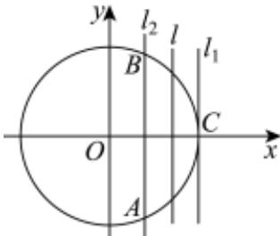
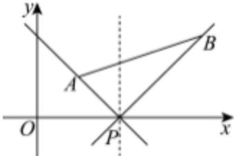

> [!faq]- 2024-2025学年内蒙古包头九中外国语学校高二（上）期中数学试卷解析
>
> > [!success]- **【答案】** ①③④
>
> > [!note]- **【解析】**
> > 圆 $C: x^2 + y^2 = 8$ 的圆心 $C(0,0)$ ，半径 $r = 2\sqrt{2}$ .
> >
> > 令y=0，则x=2，可知直线l过定点 $P(2,0)$ .
> >
> > 设圆心C到直线l的距离为d，可知 $0 \leqslant d \leqslant |CP| = 2$ .
> >
> > 对于①：圆C截直线l的弦长为 $2\sqrt{r^{2}-d^{2}}=2\sqrt{8-d^{2}}\geq4$ ，当且仅当d=2时，等号成立.
> >
> > 所以圆C截直线l的最短弦长为4，故①正确：
> >
> > 对于②：因为 $r-(2\sqrt{2}-2)=2\geq d$ ，当m=0时，直线l:x=2，
> >
> > 此时到直线 $l$ 的距离为 $2\sqrt{2} - 2$ 的点在直线 $l_{1}: x = 2\sqrt{2}$ 或直线 $l_{2}: x = 4 - 2\sqrt{2}$ 上，
> >
> > 如图直线 $l_{1}$ 与圆 $C$ 相切，直线 $l_{2}$ 与圆 $C$ 相交，如图，则此时圆 $C$ 上只有3个点到直线 $l$ 的距离为 $2\sqrt{2} - 2$ ，故②不正确.
> >
> > 
> >
> > 所以圆C上存在4个或3个点到直线l的距离为 $2\sqrt{2}-2$ ，故②错误；
> >
> > 对于③： $\triangle CMN$ 面积 $S_{\triangle CMN} = \frac{1}{2} d \times 2\sqrt{8 - d^2} = \sqrt{-(d^2 - 4)^2 + 16} \leq 4$ ，当且仅当 $d^2 = 4$
> >
> > 即 $d = 2$ 时，等号成立，故③正确；
> >
> > 对于④：如图，点A，B位于直线l的两侧（或在直线l），则 $(m-1)(2+2m)\leqslant0$ ，解得 $-1\leqslant m\leqslant1$ ，故④正确.
> >
> > 故答案为：①③④.
> >
> > 
