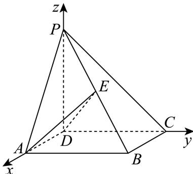

> [!faq]- 2024-2025学年内蒙古包头九中外国语学校高二（上）期中数学试卷解析
>
> > [!success]- **【答案】** 详见解析
>
> > [!note]- **【解析】**
> > 详见解析
> >
> > (1) 因为底面ABCD是正方形，PD⊥平面ABCD，
> >
> > 则以点 $D$ 为原点，分别以 $DA$ ， $DC$ ， $DP$ 所在直线为 $\pmb{x}$ ， $\pmb{y}$ ， $z$ 轴，建立如图空间直角坐标系
> >
> > 
> >
> > 则 $D(0,0,0)$ ， $A(1,0,0)$ ， $B(1,1,0)$ ， $C(0,1,0)$ ， $P(0,0,1)$ ， $E(\frac{1}{2},\frac{1}{2},\frac{1}{2})$
> >
> > 设直线BD与直线PC所成的角为θ，
> >
> > 因为 $\overrightarrow{BD} = (-1, -1, 0), \overrightarrow{PC} = (0, 1, -1)$
> >
> > $$
> > \cos \theta = \frac {| \overrightarrow {B D} \bullet \overrightarrow {P C} |}{| \overrightarrow {B D} | \bullet | \overrightarrow {P C} |} = \frac {1}{\sqrt {2} \times \sqrt {2}} = \frac {1}{2},
> > $$
> >
> > 所以直线BD与直线PC所成角为 $\frac{\pi}{3}$ ;
> >
> > (2)因为 $\overrightarrow{DA} = (1,0,0),\overrightarrow{PC} = (0,1, - 1),\overrightarrow{DE} = (\frac{1}{2},\frac{1}{2},\frac{1}{2}),\overrightarrow{DB} = (1,1,0)$
> >
> > $$
> > \overrightarrow {D A} \bullet \overrightarrow {P C} = 1 \times 0 + 0 \times 1 + 0 \times (- 1) = 0
> > $$
> >
> > $\overrightarrow{DE} \bullet \overrightarrow{PC} = 0 \times \frac{1}{2} + 1 \times \frac{1}{2} + (-1) \times \frac{1}{2} = 0,$
> >
> > 则 $\overrightarrow{PC} = (0,1, - 1)$ 为平面 $ADE$ 的一个法向量，
> >
> > 设点 $B$ 到平面 $ADE$ 的距离为 $\pmb{d}$ ，所以 $\pmb{d} = \frac{|\overrightarrow{DB} \bullet \overrightarrow{PC}|}{|\overrightarrow{PC}|} = \frac{1}{\sqrt{2}} = \frac{\sqrt{2}}{2}$ ，
> >
> > 所以点B到平面ADE的距离为 $\frac{\sqrt{2}}{2}$ .
