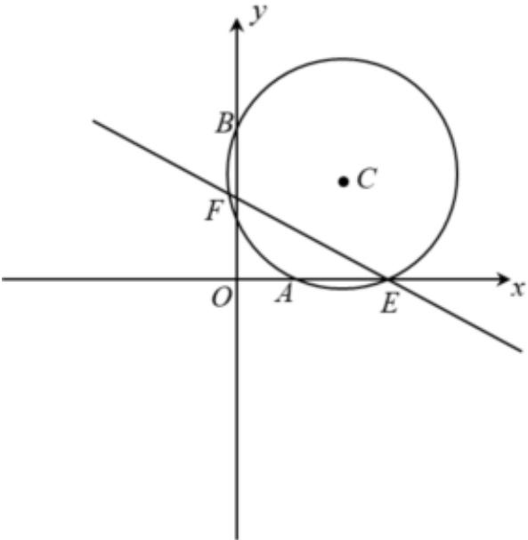

> [!faq]- 2024-2025学年内蒙古包头九中外国语学校高二（上）期中数学试卷解析
>
> > [!success]- **【答案】** 详见解析
>
> > [!note]- **【解析】**
> > 详见解析
> >
> > （1）设圆 $C$ 的方程为 $x^{2} + y^{2} + Dx + Ey + F = 0(D^{2} + E^{2} - 4F > 0)$
> >
> > 则 $\left\{ \begin{array}{l} 4 + 2D + F = 0 \\ 16 + 4E + F = 0 \\ -\frac{D}{2} - \frac{E}{2} - 6 = 0 \end{array} \right.$ ，解得 $\left\{ \begin{array}{l} D = -6 \\ E = -6 \\ F = 8 \end{array} \right.$
> >
> > 所以圆 $C$ 的方程为 $x^{2} + y^{2} - 6x - 6y + 8 = 0$
> >
> > (2)圆C的标准方程为 $(x-3)^{2}+(y-3)^{2}=10$ ，
> >
> > 圆心 $C(3,3)$ ，半径 $r = \sqrt{10}$
> >
> > 设圆心到直线l的距离为d，
> >
> > 则 $2\sqrt{\left(\sqrt{10}\right)^{2}-d^{2}}=6$ ，解得d=1，
> >
> > 当直线l的斜率不存在时，方程为x=4，
> >
> > 圆心 $C(3,3)$ 到直线 $l$ 的距离为 $\vert 3 - 4\vert = 1$ ，符合题意，
> >
> > 当直线 $l$ 的斜率存在时，设直线方程为 $y = k(x - 4)$ ，即 $kx - y - 4k = 0$
> >
> > 则 $\frac{|3k - 3 - 4k|}{\sqrt{k^2 + 1}} = 1$ ，解得 $k = -\frac{4}{3}$
> >
> > 所以直线l的方程为 $4x + 3y - 16 = 0$ ，
> >
> > 综上所述，直线l的方程为x=4或 $4x+3y-16=0$ .
> >
> > 
