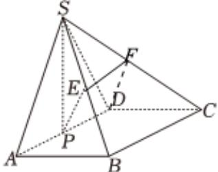
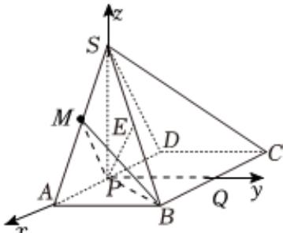

> [!faq]- 2024-2025学年内蒙古包头九中外国语学校高二（上）期中数学试卷解析
>
> > [!success]- **【答案】** 详见解析
>
> > [!note]- **【解析】**
> > 详见解析
> >
> > (1)证明：取 $SC$ 的中点 $\pmb{F}$ ，连接 $DF$ ， $EF$ ，
> >
> > 
> >
> > 因为 $E$ 为 $SB$ 的中点，可得 $EF / / BC$ ，且 $EF = \frac{1}{2} BC$
> >
> > 又因为 $P$ 为 $AD$ 的中点，可得 $DP / / BC$ ，且 $DP = \frac{1}{2} BC$
> >
> > 所以 $EF//PD$ ，且EF=PD
> >
> > 所以四边形PDFE为平行四边形，所以PE//DF
> >
> > 又因为 $PE \notin$ 平面 $SCD, DF \subset$ 平面 $SCD$
> >
> > 所以PE//平面SCD；
> >
> > (2)在棱SA上存在点M，使得平面PBM与平面SAD的夹角的余弦值为 $\frac{\sqrt{21}}{7}$ ，说明如下：取BC的中点Q，连接PQ，由题意可得 $PQ\perp AD$ ， $\triangle SAD$ 是正三角形，且平面 $SAD \perp$ 平面ABCD，AB = 1，P为棱AD的中点，平面 $SAD \cap$ 平面ABCD = AD，
> >
> > 可得 $SP \perp$ 平面ABCD，
> >
> > 设AD为2a，可设 $SP=\sqrt{3}a$ ，
> >
> > 又因为四棱锥 $S - ABCD$ 的体积为 $\frac{2\sqrt{3}}{3}$ ，即 $\frac{1}{3} \times 2a \times 1 \times \sqrt{3} a = \frac{2\sqrt{3}}{3}$ ，
> >
> > 可得a=1，即AD=2，
> >
> > 以 $P$ 为坐标原点，以 $PA, PQ, PS$ 所在的直线分别为 $x, y, z$ 轴建立空间直角坐标系，
> >
> > 
> >
> > 即 $P(0,0,0),A(1,0,0),B(1,1,0),S(0,0,\sqrt{3}),D(-1,0,0),C(-1,1,0)$
> >
> > $$
> > \overrightarrow {P B} = (1, 1, 0), \overrightarrow {S A} = (1, 0, - \sqrt {3}), \overrightarrow {P S} = (0, 0, \sqrt {3})
> > $$
> >
> > 设 $\overrightarrow{SM} = t\overrightarrow{SA} = (t,0, - \sqrt{3} t)$ ，可得 $\overrightarrow{PM} = \overrightarrow{PS} +\overrightarrow{SM} = (t,0,\sqrt{3} (1 - t))$
> >
> > 设平面PBM的法向量为 $\overrightarrow{n}=(x,y,z)$ ，
> >
> > 则 $\left\{ \begin{array}{l} \overrightarrow{n} \cdot \overrightarrow{PB} = 0 \\ \overrightarrow{n} \cdot \overrightarrow{PM} = 0 \end{array} \right.$ ，即 $\left\{ \begin{array}{l} x + y = 0 \\ x t + \sqrt{3} (1 - t) z = 0 \end{array} \right.$
> >
> > 令 $z = t$ ，可得 $\overrightarrow{n} = (\sqrt{3}(t - 1),\sqrt{3}(1 - t),t)$
> >
> > 易得平面 $S A D$ 的法向量为 $\overrightarrow{m} = (0,1,0)$
> >
> > 可得 $\overrightarrow{n} \cdot \overrightarrow{m} = \sqrt{3}(1 - t), |\overrightarrow{n}| = \sqrt{3(1 - t)^2 + 3(t - 1)^2 + t^2} = \sqrt{7t^2 - 12t + 6}, |\overrightarrow{m}| = 1,$
> >
> > 因为平面PBM与平面SAD的夹角的余弦值为 $\frac{\sqrt{21}}{7}$
> >
> > $$
> > \frac {\sqrt {2 1}}{7} = | \cos <   \overrightarrow {n}, \overrightarrow {m} > | = | \frac {\overrightarrow {n} \cdot \overrightarrow {m}}{| \overrightarrow {n} | \cdot | \overrightarrow {m} |} | = | \frac {\sqrt {3} (1 - t)}{\sqrt {7 t ^ {2} - 1 2 t + 6} \times 1} |.
> > $$
> >
> > 整理可得： $2t - 1 = 0$ ，可得 $t = \frac{1}{2}$ ，即 $M$ 为 $SA$ 的中点
