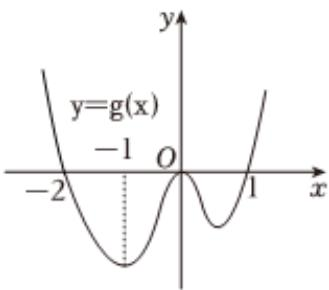

<!-- question-source:start -->
2、设函数 $f(x)$ 在R上可导，其导函数为 $f'(x)$ ，且函数 $g(x) = x f'(x)$ 的图象如图所示，则下列结论中一定成立的是（）
A $f(x)$ 有三个极值点
B $f(0)$ 为函数的极大值
C $f(-1)$ 为 $f(x)$ 的极小值
D $f(x)$ 有两个极小值

<!-- question-source:end -->

![[Q00091788A1]]
