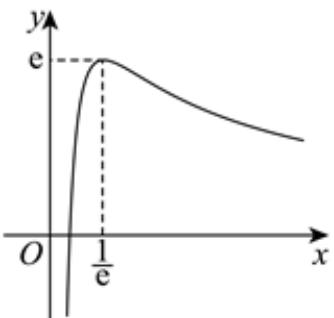

> [!faq]- 2024-2025学年内蒙古包头九中外国语学校高二（下）期中数学试卷解析
>
> > [!success]- **【答案】** 51
>
> > [!note]- **【解析】**
> > 根据题意，分2种情况讨论，
> >
> > ①，在5个节目中任选3个，同时有A、B时，有 $C_{3}^{1}$ 种选法，要求A需排在B的前面出场，有3种情况，则此时有 $3 \times 3 = 9$ 种排法，
> >
> > $$
> > C _ {5} ^ {3} - C _ {3} ^ {1} = 7
> > $$
> >
> > $$
> > A _ {3} ^ {3} = 6
> > $$
> >
> > $$
> > 7 \times 6 = 4 2 \text {和}
> > $$
> >
> > 则一共有 $9 + 42 = 51$ 种排法；
> >
> > 故答案为：51
> >
> > 3、 $f(x)=\ln x-ax+2=0(a\in R)$ 定义域为 $(0,+\infty)$ ,
> >
> > 故 $\frac{lnx + 2}{x} = a$ 有两个不同的根，即 $g(x) = \frac{lnx + 2}{x}$ ， $x \in (0, +\infty)$ 与 $y = a$ 两函数有两个交点，
> >
> > 其中 $g^{\prime}(x) = \frac{1 - \ln x - 2}{x^{2}} = -\frac{1 + \ln x}{x^{2}}$
> >
> > 当 $x>\frac{1}{e}$ 时， $g^{\prime}(x)<0$ ，当 $0<x<\frac{1}{e}$ 时， $g^{\prime}(x)>0$ ，
> >
> > 故 $g(x)=\frac{lnx+2}{x}$ 在 $0<x<\frac{1}{e}$ 上单调递增，在 $x>\frac{1}{e}$ 上单调递减，
> >
> > 从而 $g(x)=\frac{lnx+2}{x}$ 在 $x=\frac{1}{e}$ 处取得极大值，也是最大值，
> >
> > $g(x)_{max} = \frac{-1 + 2}{\frac{1}{e}} = e$ ，且当 $x > \frac{1}{e^2}$ 时， $g(x) = \frac{lnx + 2}{x} >0$ 恒成立，
> >
> > 当 $0 < x < \frac{1}{e^2}$ 时， $g(x) = \frac{lnx + 2}{x} < 0$ 恒成立，
> >
> > 画出 $g(x)=\frac{lnx+2}{x}$ 的图象如下：
> >
> > 
> >
> > 显然要想 $g(x)=\frac{lnx+2}{x}$ ， $x\in(0,+\infty)$ 与y=a两函数有两个交点，
> >
> > 需要满足 $a \in (0, e)$ .
> >
> > 故答案为： $(0,e)$ .
