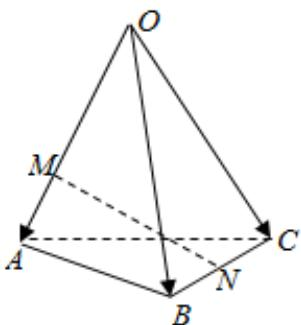

<!-- question-source:start -->
2、如图，空间四边形OABC中， $\overrightarrow{OA}=\overrightarrow{a}$ ， $\overrightarrow{OB}=\overrightarrow{b}$ ， $\overrightarrow{OC}=\overrightarrow{c}$ ，点M在 $\overrightarrow{OA}$ 上，且OM=2MA，点N为BC中点，则 $\overrightarrow{MN}=(\quad)$

A $\frac{1}{2}\overrightarrow{a} -\frac{2}{3}\overrightarrow{b} +\frac{1}{2}\overrightarrow{c}$ B $-\frac{2}{3}\overrightarrow{a} +\frac{1}{2}\overrightarrow{b} +\frac{1}{2}\overrightarrow{c}$ C $\frac{1}{2}\overrightarrow{a} +\frac{1}{2}\overrightarrow{b} -\frac{1}{2}\overrightarrow{c}$ D $\frac{2}{3}\overrightarrow{a} +\frac{2}{3}\overrightarrow{b} -\frac{1}{2}\overrightarrow{c}$
<!-- question-source:end -->

![[Q00090710A1]]
