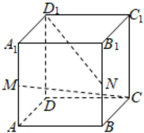

<!-- question-source:start -->
4、如图，正方体 $ABCD - A_{1}B_{1}C_{1}D_{1}$ 中，点 $M$ ， $N$ 分别为棱 $A_{1}A$ ， $B_{1}B$ 的中点，则 $CM$ 和 $D_{1}N$ 所成角的余弦值为（）

$$
- \frac {1}{9}
$$

$$
\frac {1}{9}
$$

$$
- \frac {1}{8}
$$

$$
\frac {1}{8}
$$
<!-- question-source:end -->

![[Q00090712A1]]
