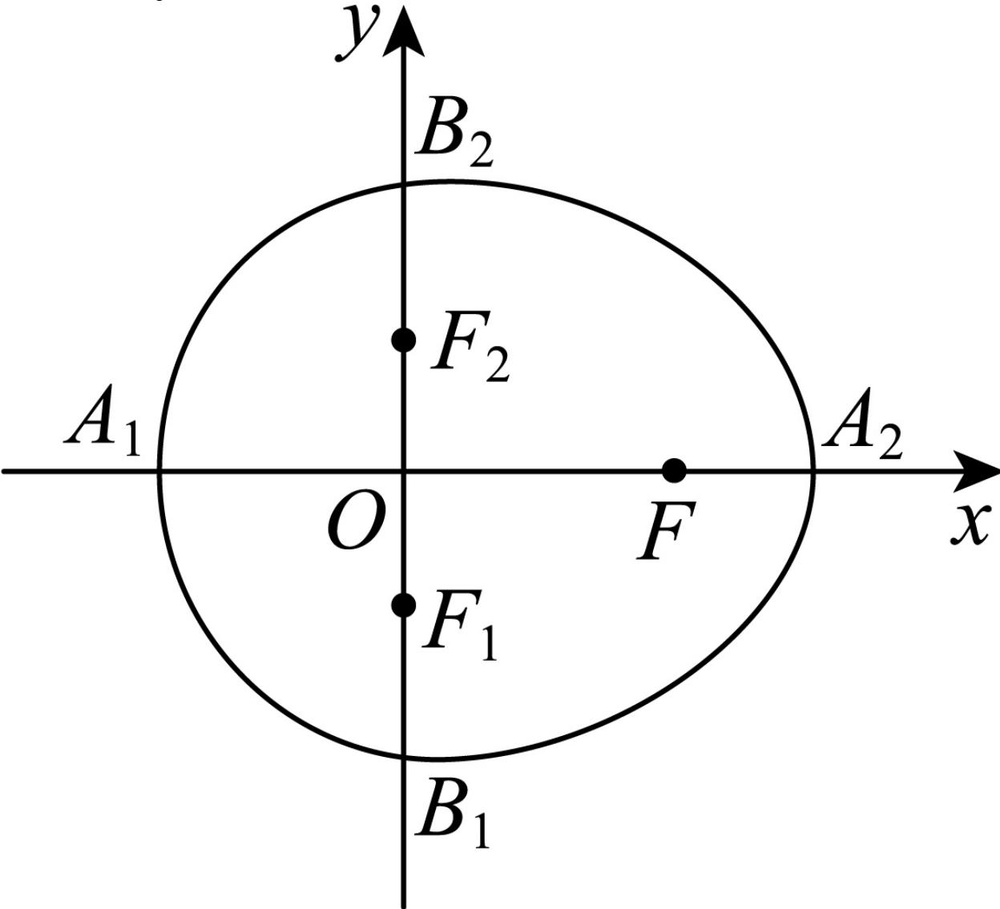

<!-- question-source:start -->
5、“曲线 $M$ ”：由半椭圆 $\frac{x^2}{a^2} +\frac{y^2}{b^2} = 1(x\geqslant 0)$ 与半椭圆 $\frac{x^2}{c^2} +\frac{y^2}{b^2} = 1(x\leqslant 0)$ 组成，其中 $a^2 = b^2 +c^2$ ， $a > b > c > 0.$ 如图，设点 $F$ ， $F_{1}$ ， $F_{2}$ 是相应椭圆的焦点， $A_{1}$ ， $A_{2}$ 和 $B_{1}$ ， $B_{2}$ 分别是

“曲线M”与x，y轴的交点，N为线段 $A_{1}A_{2}$ 的中点.

1 若等边 $\triangle FF_{1}F_{2}$ 的重心坐标为 $\left(\frac{\sqrt{3}}{3},0\right)$ ，求“曲线 $M$ ”的方程；

设 $P$ 是“曲线 $M$ ”的半椭圆 $\frac{y^2}{b^2} +\frac{x^2}{c^2} = 1(x\leqslant 0)$ 上任意的一点.求证：当 $|PN|$ 取得最小值时， $P$ 在点 $B_{1}$ ， $B_{2}$ 或 $A_{1}$ 处；

3 作垂直于 $y$ 轴的直线与“曲线 $M$ ”交于两点 $H, K$ ，求线段 $HK$ 中点的轨迹方程.
<!-- question-source:end -->

![[Q00090727A1]]
