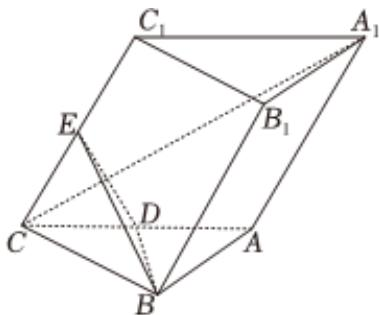

<!-- question-source:start -->
4. 如图，在三棱柱 $ABC-A_{1}B_{1}C_{1}$ 中，底面是边长为2的等边三角形， $CC_{1}=2,D,E$ 分别是线段AC， $CC_{1}$ 的中点， $C_{1}$ 在平面ABC内的射影为D.

1 求证： $A_{1}C \perp$ 平面BDE；

2 若点 $F$ 为棱 $B_{1}C_{1}$ 的中点，求点 $F$ 到平面 $BDE$ 的距离；

若点 $F$ 为线段 $B_{1}C_{1}$ 上的动点（不包括端点），求平面 $FBD$ 与平面 $BDE$ 夹角的余弦值的取值范围.
<!-- question-source:end -->

![[Q00092214A1]]
