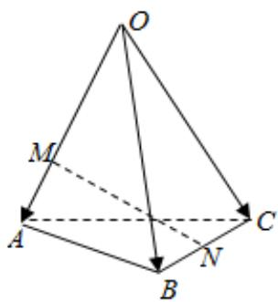

> [!faq]- 2024-2025学年内蒙古包头九中高二（上）期中数学试卷解析
>
> > [!success]- **【答案】** B
>
> > [!note]- **【解析】**
> > 由题意
> >
> > $$
> > \begin{array}{r l} & {{\overrightarrow {M N} = \overrightarrow {M A} + \overrightarrow {A B} + \overrightarrow {B N}}} \\ & {{= \frac {1}{3} \overrightarrow {O A} + \overrightarrow {O B} - \overrightarrow {O A} + \frac {1}{2} \overrightarrow {B C}}} \\ & {{= - \frac {2}{3} \overrightarrow {O A} + \overrightarrow {O B} + \frac {1}{2} \overrightarrow {O C} - \frac {1}{2} \overrightarrow {O B}}} \\ & {{= - \frac {2}{3} \overrightarrow {O A} + \frac {1}{2} \overrightarrow {O B} + \frac {1}{2} \overrightarrow {O C}}} \\ & {{\mathrm{又} \overrightarrow {O A} = \overrightarrow {a}, \overrightarrow {O B} = \overrightarrow {b}, \overrightarrow {O C} = \overrightarrow {c}}} \\ & {{\therefore \overrightarrow {M N} = - \frac {2}{3} \overrightarrow {a} + \frac {1}{2} \overrightarrow {b} + \frac {1}{2} \overrightarrow {c}}} \end{array}
> > $$
> >
> > 
> >
> > 故选：B.
