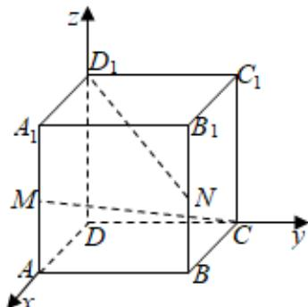

> [!faq]- 2024-2025学年内蒙古包头九中高二（上）期中数学试卷解析
>
> > [!success]- **【答案】** B
>
> > [!note]- **【解析】**
> > 建立如图所示空间直角坐标系，设正方体的棱长为2，
> >
> > 
> >
> > 则 $C(0,2,0)$ ， $D_{1}(0,0,2),M(2,0,1),N(2,2,1)$
> >
> > $$
> > \therefore \overrightarrow {C M} = (2, - 2, 1), \overrightarrow {D _ {1} N} = (2, 2, - 1)
> > $$
> >
> > $$
> > | \cos <   \overrightarrow {C M}, \overrightarrow {D _ {1} N} > = \frac {\overrightarrow {C M} \bullet \overrightarrow {D _ {1} N}}{| \overrightarrow {C M} | \bullet | \overrightarrow {D _ {1} N} |} = \frac {- 1}{3 \times 3} = - \frac {1}{9}.
> > $$
> >
> > $\therefore CM$ 和 $D_{1}N$ 所成角的余弦值为 $\frac{1}{9}$ .
> >
> > 故选：B.
