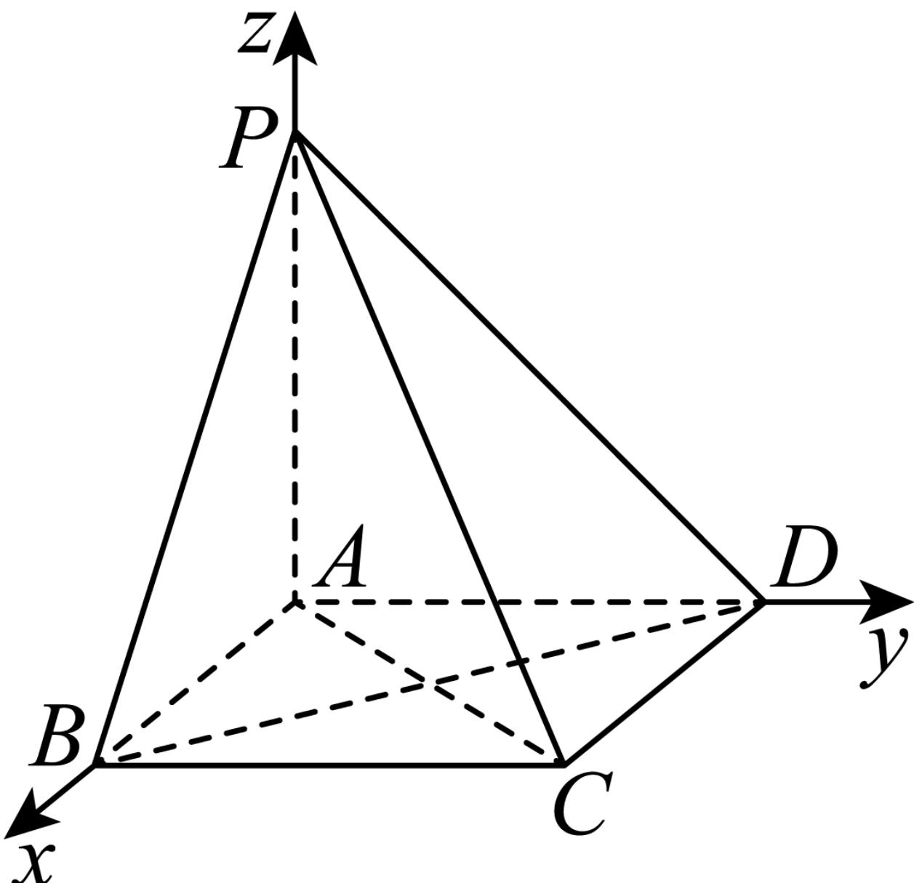

> [!faq]- 2024-2025学年内蒙古包头九中高二（上）期中数学试卷解析
>
> > [!success]- **【答案】** A
>
> > [!note]- **【解析】**
> > 在四棱锥 $P - ABCD$ 中， $PA \perp$ 平面 $ABCD$ ，且四边形 $ABCD$ 为正方形，
> >
> > 以 $A$ 为坐标原点，分别以直线 $AB$ ， $AD$ ， $AP$ 为 $\pmb{x}$ ， $\pmb{y}$ ， $z$ 轴，建立如图所示空间直角坐标系.
> >
> > 
> >
> > 则 $B(1,0,0)$ ， $D(0,1,0)$ ， $P(0,0,1)$ ， $C(1,1,0)$ ，
> >
> > 从而 $\overrightarrow{PB} = (1, 0, -1)$ , $\overrightarrow{PD} = (0, 1, -1)$ , $\overrightarrow{PC} = (1, 1, -1)$ ,
> >
> > 设平面PBD的法向量为 $\overrightarrow{n}=(x,y,z)$ ,
> >
> > 则 $\left\{ \begin{array}{l} \overrightarrow{PB} \perp \overrightarrow{n} \\ \overrightarrow{PD} \perp \overrightarrow{n} \end{array} \right.$ 则 $\left\{ \begin{array}{l} \overrightarrow{PB} \bullet \overrightarrow{n} = x - z = 0 \\ \overrightarrow{PD} \bullet \overrightarrow{n} = y - z = 0 \end{array} \right.$
> >
> > 令 $z = 1$ ，则 $\overrightarrow{n} = (1, 1, 1)$
> >
> > 设直线PC与平面PBD所成的角为 $\theta$ ，
> >
> > $$
> > | \sin \theta = | \cos <   \overrightarrow {P C}, \overrightarrow {n} > | = \frac {| \overrightarrow {P C} \bullet \overrightarrow {n} |}{| \overrightarrow {P C} | | \overrightarrow {n} |} = \frac {1 + 1 - 1}{\sqrt {3} \times \sqrt {3}} = \frac {1}{3}.
> > $$
> >
> > 故选：A.
