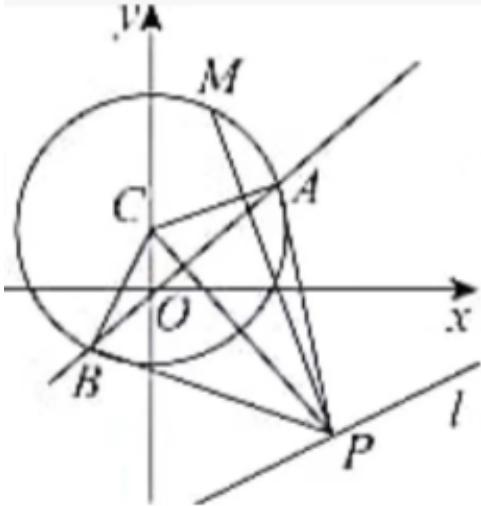

> [!faq]- 2024-2025学年内蒙古包头九中高二（上）期中数学试卷解析
>
> > [!success]- **【答案】** ACD
>
> > [!note]- **【解析】**
> > 对于A，由切线长定理可得 $|PA|=|PB|$ ，又因为 $|CA|=|CB|$ ，所以 $\triangle PAC\cong\triangle PBC$ ，所以四边形PACB的面积 $S=2S_{\triangle PAC}=|PA|\bullet|AC|=\sqrt{5}|PA|$ ，
> >
> > 因为 $|PA|=\sqrt{|CP|^{2}-|CA|^{2}}=\sqrt{|CP|^{2}-5}$ ，当 $CP\perp l$ 时， $|CP|$ 取最小值，且
> >
> > $$
> > | C P | _ {m i n} = \frac {| 0 - 2 - 8 |}{\sqrt {5}} = 2 \sqrt {5},
> > $$
> >
> > 所以四边形 $PACB$ 的面积的最小值为 $S = \sqrt{5} \times \sqrt{(2\sqrt{5})^2 - 5} = 5\sqrt{3}$ ，故 $A$ 正确；
> >
> > 对于 $B$ ，因为 $\left|CP\right|_{min} = \frac{\left|0 - 2 - 8\right|}{\sqrt{5}} = 2\sqrt{5}$ ，所以 $MP$ 最小值为 $\left|CP\right|_{min} - r = 2\sqrt{5} -\sqrt{5} = \sqrt{5}$ 故 $B$ 错误；
> >
> > 对于C，由题意可知点A，B，在以CP为直径的圆上，
> >
> > 设 $P(2a + 8, a)$ ，其圆的方程为： $(x - a - 4)^2 + (y - \frac{a + 1}{2})^2 = \frac{(2a + 8)^2 + (a - 1)^2}{4}$
> >
> > 化简为 $x^{2} - (2a + 8)x + y^{2} - (a + 1)y + a = 0$ ，与方程 $x^{2} + (y - 1)^{2} = 5$ 相减可得： $(2a + 8)x + (a - 1)y - (a + 4) = 0$
> >
> > 则直线 $AB$ 的方程为 $(2a + 8)x + (a - 1)y - (a + 4) = 0$ ，当 $|PA|$ 最短时， $CP \perp l$ ，则 $\frac{a - 1}{2a + 8} \times \frac{1}{2} = -1$
> >
> > 解得 $a = -3$ ，故直线 $AB$ 的方程为 $2x - 4y - 1 = 0$ ，故 $C$ 正确；
> >
> > 对于D，当 $|PA|$ 最短时，圆心C到直线2x-4y-1=0的距离 $d=\frac{|0-4-1|}{2\sqrt{5}}=\frac{\sqrt{5}}{2}$ ，
> > 所以弦AB长为 $2\sqrt{r^{2}-d^{2}}=2\sqrt{5-\frac{5}{4}}=\sqrt{15}$ ，故D正确.
> > 故答案为：ACD.
> >
> > 
