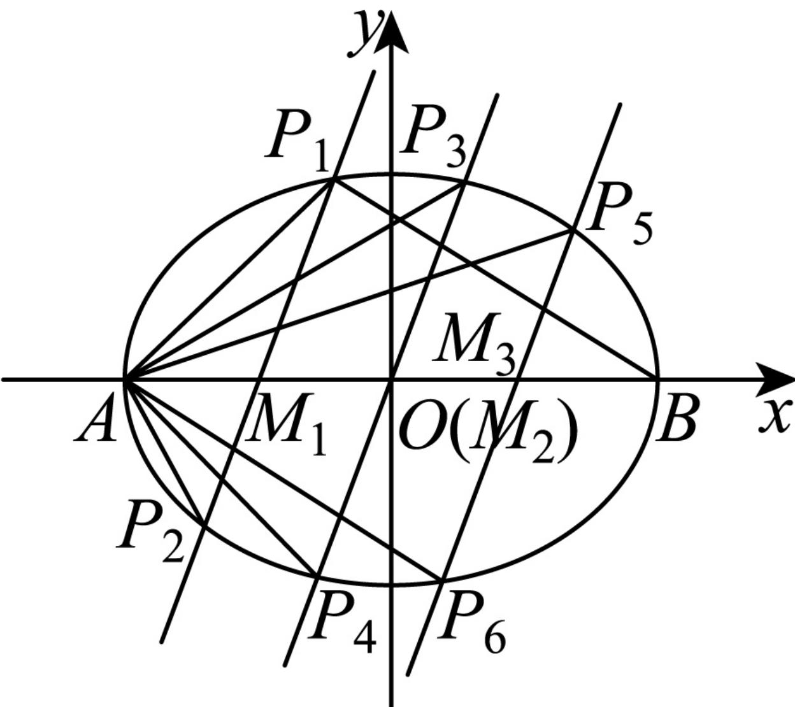

> [!faq]- 2024-2025学年内蒙古包头九中高二（上）期中数学试卷解析
>
> > [!success]- **【答案】** $-\frac{8}{27}$
>
> > [!note]- **【解析】**
> > 由题意可得 $A(-\sqrt{3}, 0), B(\sqrt{3}, 0)$
> >
> > $M_{1}$ ， $M_{2}$ ， $M_{3}$ 为其长轴 $AB$ 上从左到右的3个四等分点，故 $M_{2}$ 与原点重合，
> >
> > 
> >
> > 设椭圆上任意一点坐标为 $P(x_0, y_0)$ ，且 $x_0 \neq \pm \sqrt{3}$
> >
> > 则 $\frac{x_0^2}{3} +\frac{y_0^2}{2} = 1$ ，所以 $y_{0}^{2} = 2 - \frac{2x_{0}^{2}}{3}$
> >
> > 则 $k_{Ap}k_{BP} = \frac{y_0}{x_0 + \sqrt{3}}\bullet \frac{y_0}{x_0 - \sqrt{3}} = \frac{y_0^2}{x_0^2 - 3} = \frac{2 - \frac{2x_0^2}{3}}{x_0^2 - 3} = -\frac{2}{3}$
> >
> > 由对称性可知， $k_{BP_1} = k_{AP_6}$ ，故 $k_{AP_1}k_{AP_6} = k_{AP_1}k_{BP_1} = -\frac{2}{3}$
> >
> > 同理可得 $k_{AP_{2}}k_{AP_{5}}=k_{AP_{3}}k_{AP_{4}}=-\frac{2}{3}$ ，
> >
> > 所以6条直线 $AP_{1}$ ， $AP_{2}$ ， $AP_{3}$ ，… $AP_{6}$ 的斜率乘积为 $\left(-\frac{2}{3}\right)^{3}=-\frac{8}{27}$ .
> >
> > 故答案为： $-\frac{8}{27}$ .
