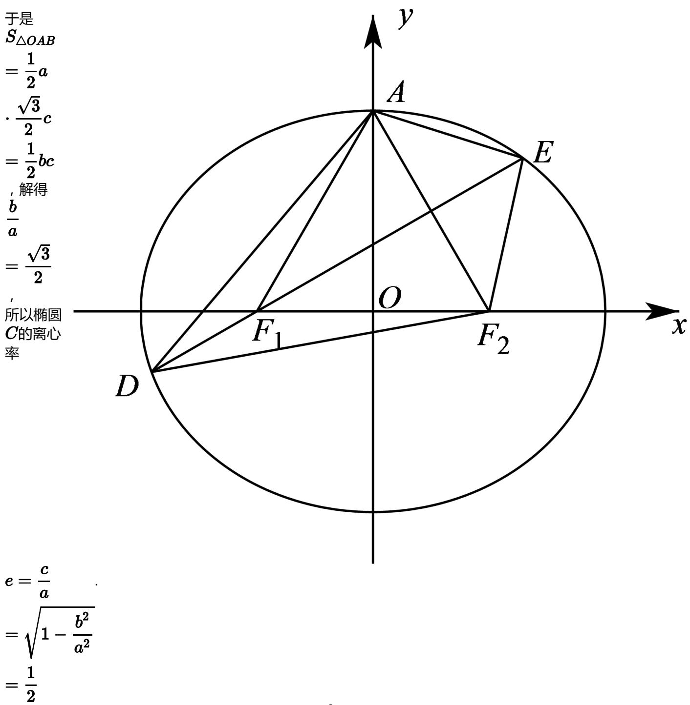

> [!faq]- 2024-2025学年内蒙古包头九中高二（上）期中数学试卷解析
>
> > [!success]- **【答案】** 详见解析
>
> > [!note]- **【解析】**
> > 详见解析
> >
> > (1)由题意可令 $F_{2}(c,0)$ ，则 $|AF_{2}|$ ，
> >
> > $$
> > \begin{array}{r l} A (0, b) & = \sqrt {c ^ {2} + b ^ {2}} \\ & = a \end{array}
> > $$
> >
> > 又 $\triangle OAF_{2}$ 是直角三角形，
> >
> > 
> >
> > 所以椭圆C的离心率
> >
> > (2)由(1)知， $a = 2c$ ， $b^{2} = a^{2}$ ，椭圆的方程为 $\frac{x^2}{4c^2}$
> >
> > $$
> > \begin{array}{l} {- c ^ {2}} \\ {= 3 c ^ {2}} \end{array}
> > $$
> >
> > $$
> > \begin{array}{l} {+ \frac {y ^ {2}}{3 c ^ {2}}} \\ {= 1} \end{array}
> > $$
> >
> > 如图所示， $\left|AF_{2}\right|$ ， $\left|OF_{2}\right|$ ， $\angle AF_{2}O$ ，即 $\triangle AF_{1}F_{2}$ 为正三角形，
> > = a = c = $\frac{\pi}{3}$
> >
> > 又过 $F_{1}$ 且垂直于 $AF_{2}$ 的直线与 $C$ 交于 $D$ ， $E$ 两点，则 $DE$ 为线段 $AF_{2}$ 的垂直平分线，
> >
> > 直线 $DE$ 的斜率为 $\frac{\sqrt{3}}{3}$ ，直线 $DE$ 的方程： $x = \sqrt{3} y - c$ ，
> >
> > 由 $\left\{\begin{aligned}x&=\sqrt{3}y-c\\ 3x^{2}&+4y^{2}-12c^{2}=0\end{aligned}\right.$ ，得 $13y^{2}-6\sqrt{3}cy-9c^{2}=0$ ，
> >
> > $$
> > \Delta = (6 \sqrt {3} c) ^ {2} + 4 \times 1 3 \times 9 c ^ {2} = 5 7 6 c ^ {2} > 0,
> > $$
> >
> > $$
> > y _ {1} + y _ {2} = \frac {6 \sqrt {3} c}{1 3}, y _ {1} y _ {2} = - \frac {9 c ^ {2}}{1 3}
> > $$
> >
> > 所以 $|DE|=\sqrt{1+(\sqrt{3})^{2}}|y_{1}-y_{2}|=2\cdot\sqrt{(y_{1}+y_{2})^{2}-4y_{1}y_{2}}$
> >
> > $$
> > = 2 \cdot \sqrt {\left(\frac {6 \sqrt {3} c}{1 3}\right) ^ {2} + \frac {3 6 c ^ {2}}{1 3}} = \frac {4 8 c}{1 3} = 6
> > $$
> >
> > 解得 $c = \frac{13}{8}$ ，得 $a = 2c = \frac{13}{4}$ ，由 $DE$ 垂直平分线段 $AF_{2}$ ，得 $\vert AD\vert = \vert DF_2\vert$ ， $\vert AE\vert = \vert EF_2\vert$
> >
> > 因此 $\triangle ADE$ 的周长等于 $\triangle F_{2}DE$ 的周长，利用椭圆的定义得到 $\triangle F_{2}DE$ 周长为：
> >
> > $$
> > \left| D F _ {2} \right| + \left| E F _ {2} \right| + \left| D E \right| = \left| D F _ {2} \right| + \left| E F _ {2} \right| + \left| D F _ {1} \right| + \left| E F _ {1} \right| = \left| D F _ {1} \right| + \left| D F _ {2} \right| + \left| E F _ {1} \right|
> > $$
> >
> > $$
> > + \left| E F _ {2} \right| = 2 a + 2 a = 4 a = 1 3
> > $$
