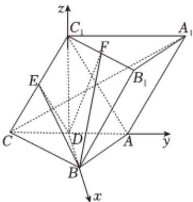

> [!faq]- 2024-2025学年内蒙古包头九中高二（上）期中数学试卷解析
>
> > [!success]- **【答案】** 详见解析
>
> > [!note]- **【解析】**
> > 详见解析
> >
> > （1）证明：连接 $AC_{1}$ ，因为 $\triangle ABC$ 为等边三角形， $D$ 为 $AC$ 的中点，所以 $BD\bot AC$ 又 $C_1D\bot$ 面 $ABC$ ， $BD\subset$ 面 $ABC$ 所以 $C_1D\bot BD$ 因为 $AC\cap C_1D = D$ ， $AC$ ， $C_1D\subset$ 面 $AA_{1}C_{1}C$ 所以 $BD\bot$ 面 $AA_{1}C_{1}C$ 又 $A_{1}C\subset$ 面 $AA_{1}C_{1}C$ 所以 $BD\bot A_{1}C$ 由题设四边形 $AA_{1}C_{1}C$ 为菱形，所以 $A_{1}C\bot AC_{1}$ 因为 $D$ ， $E$ 分别为 $AC$ ， $CC_{1}$ 的中点，所以 $DE / / AC_{1}$ 所以 $A_{1}C\bot DE$ 因为 $BD\cap DE = D$ ， $BD\cap DE = D$ ， $BD\subset$ 面 $BDE$ ， $DE\subset$ 面 $BDE$ 所以 $A_{1}C\bot$ 面 $BDE.$ (2)因为 $C_1D\bot$ 面 $ABC$ ， $BD$ ， $AC\subset$ 面 $ABC$ 所以 $C_1D\bot BD$ ， $C_1D\bot AC$ 又△ABC为等边三角形， $D$ 为 $AC$ 的中点，所以 $BD\bot AC$ 则以 $D$ 为坐标原点， $\overrightarrow{DB},\overrightarrow{DA},\overrightarrow{DC_1}$ 所在直线为 $\pmb {x},\pmb {y}$ ，z轴建立空间直角坐标系则 $D(0,0,0),B(\sqrt{3},0,0),C(0, - 1,0),C_1(0,0,\sqrt{3}),E(0, - \frac{1}{2},\frac{\sqrt{3}}{2}),B_1(\sqrt{3},1,\sqrt{3})$ ， $A_{1}(0,2,\sqrt{3}),F(\frac{\sqrt{3}}{2},\frac{1}{2},\sqrt{3})$ 平面 $BDE$ 的一个法向量 $\overrightarrow{m} = \overrightarrow{CA_1} = (0,3,\sqrt{3}),\overrightarrow{DF} = (\frac{\sqrt{3}}{2},\frac{1}{2},\sqrt{3})$ 所以点 $F$ 到平面 $BDE$ 的距离 $d = \frac{|\vec{m}\bullet\overrightarrow{DF}|}{|\vec{m}|} = \frac{\frac{3}{2} + 3}{2\sqrt{3}} = \frac{3\sqrt{3}}{4}.$ (3)因为 $\overrightarrow{C_1B_1} = (\sqrt{3},1,0),\overrightarrow{CA_1} = (0,3,\sqrt{3})$ 设 $F(x,y,z),\overrightarrow{C_1F} = \lambda \overrightarrow{C_1B_1}(0 <   \lambda <  1)$ 则 $(x,y,z - \sqrt{3}) = (\sqrt{3}\lambda ,\lambda ,0)$ 所以 $x = \sqrt{3}\lambda ,y = \lambda ,z = \sqrt{3}$ 所以 $F(\sqrt{3}\lambda ,\lambda ,\sqrt{3})$ 所以 $\overrightarrow{DF} = (\sqrt{3}\lambda ,\lambda ,\sqrt{3})$ 由（1）知 $A_{1}C$ 上面 $BDE$ 所以平面 $BDE$ 的一个法向量 $\overrightarrow{m} = \overrightarrow{CA_1} = (0,3,\sqrt{3})$ 设平面 $FBD$ 的法向量 $\overrightarrow{n} = (a,b,c)$ 则 $\left\{ \begin{array}{l}\sqrt{3} a = 0\\ \sqrt{3}\lambda a + \lambda b + \sqrt{3} c = 0 \end{array} \right.$ 令 $b = \sqrt{3}$ ，则 $a = 0,c = -\lambda$ 所以 $\vec{n} = (0,\sqrt{3}, - \lambda)$ 所以 $|\cos <  \overrightarrow{m},\overrightarrow{n} >| = \frac{|\vec{m}\bullet\vec{n}|}{|\vec{m}||\vec{n}|} = \frac{|3\sqrt{3} - \sqrt{3}\lambda|}{2\sqrt{3}\bullet\sqrt{3 + \lambda^2}} = \frac{|3 - \lambda|}{2\sqrt{3 + \lambda^2}} = \frac{1}{2}\cdot \sqrt{\frac{(3 - \lambda)^2}{3 + \lambda^2}}$ 令 $3 - \lambda = t\in (2,3)$ ，则 $\lambda = 3 - t$ 所以 $|\cos <  \overrightarrow{m},\overrightarrow{n} >| = \frac{1}{2}\cdot \sqrt{\frac{(3 - \lambda)^2}{3 + \lambda^2}} = \frac{1}{2}\cdot \sqrt{\frac{t^2}{12 - 6t + t^2}} = \frac{1}{2}\cdot \sqrt{\frac{1}{\frac{12}{t^2} + \frac{6}{t} + 1}}$
> >
> > 
> >
> > 因为 $t\in\left(\frac{1}{3},\frac{1}{2}\right)$ ,
> >
> > 所以 $\frac{12}{t^2} -\frac{6}{t} +\mathbf{1}\in \left(\frac{1}{3},\mathbf{1}\right),$
> >
> > 所以 $|\cos < \overrightarrow{m}, \overrightarrow{n} > |\in (\frac{1}{2}, \frac{\sqrt{3}}{2})$
> >
> > 所以锐二面角 $F - BD - E$ 的余弦值的取值范围为 $(\frac{1}{2}, \frac{\sqrt{3}}{2})$ .
