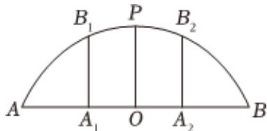

<!-- question-source:start -->
2、某圆拱桥的圆拱的平面图如图所示，该圆拱的跨度AB=24m，拱高OP=8m。为加固该圆拱桥，现决定建造两根支柱 $A_{1}B_{1}$ ， $A_{2}B_{2}$ （将支柱 $A_{1}B_{1}$ ， $A_{2}B_{2}$ 视为两条线段），且 $OA_{1}=OA_{2}=5m$ ，则支柱 $A_{1}B_{1}$ 的高度为\_\_\_\_m。

<!-- question-source:end -->

![[Q00091810A1]]
