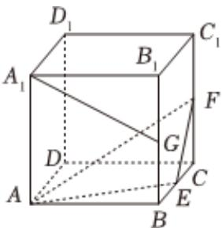

<!-- question-source:start -->
3、如图所示，正方体 $ABCD - A_{1}B_{1}C_{1}D_{1}$ 的棱长为1， $E$ 、 $F$ 、 $G$ 分别为BC、 $CC_{1}$ 、 $BB_{1}$ 的中点，则下列说法正确的是（）

A 直线 $A_{1}G$ 与直线 $D_{1}D$ 所成角的余弦值为 $\frac{\sqrt{5}}{5}$ B 点 $D_{1}$ 到AF距离为 $\frac{3}{2}$ C 直线 $A_{1}G$ 与平面AEF平行
D 三棱锥 $A_{1}-AEF$ 的体积为 $\frac{1}{12}$
<!-- question-source:end -->

![[Q00092225A1]]
