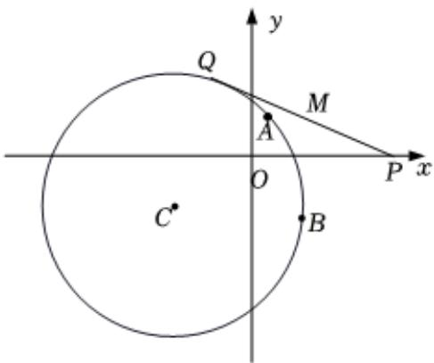

<!-- question-source:start -->
3. 若直线l交x轴负半轴于A，交y轴正半轴于B， $\triangle AOB$ 的面积为 $S(O$ 为坐标原点），求S的最小值和此时直线l的方程.

已知圆心为 $C$ 的圆经过 $A(1,1)$ 和 $B(2, - 2)$ ，且圆心 $C$ 在直线 $l:x - y + 1 = 0$ 上

1 求圆心为 $C$ 的圆的标准方程；

2 线段 $PQ$ 的端点 $P$ 的坐标是 $(5,0)$ ，端点 $Q$ 在圆 $C$ 上运动，求线段 $PQ$ 中点 $M$ 的轨迹方程.
<!-- question-source:end -->

![[Q00092233A1]]
