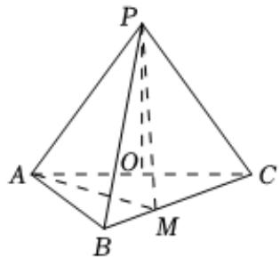

<!-- question-source:start -->
4、如图，在三棱锥 $P - ABC$ 中， $AB = BC = 2\sqrt{2}$ ， $PA = PB = PC = AC = 4$ ， $O$ 为 $AC$ 的中点.

(1)证明： $PO \perp$ 平面ABC；

(2)若点 $M$ 在棱 $BC$ 上，且 $BM = \frac{1}{3} BC$ ，求二面角 $M - PA - C$ 的大小.

<!-- question-source:end -->

![[Q00092234A1]]
