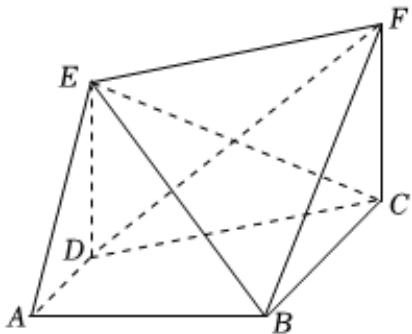

<!-- question-source:start -->
6、如图，已知梯形ABCD中， $AD / / BC$ ， $\angle DAB = 90^{\circ}$ ， $AB = BC = 2AD = 2$ ，四边形EDCF为矩形， $DE = 2$ ，平面EDCF⊥平面ABCD

1 求证：DF//平面ABE

2 若点 $P$ 在线段 $EF$ 上，且直线 $AP$ 与平面 $BEF$ 所成角的正弦值为 $\frac{\sqrt{14}}{14}$ ，求 $\frac{EP}{EF}$ 的值
<!-- question-source:end -->

![[Q00092236A1]]
