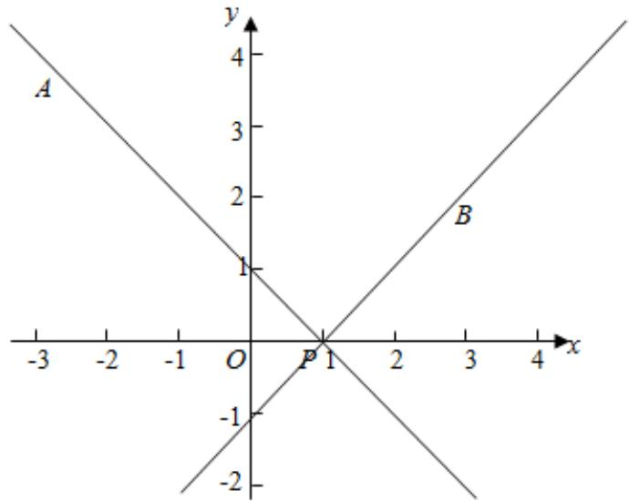

> [!faq]- 2024-2025学年内蒙古包头九十七中高二（上）期中数学试卷解析
>
> > [!success]- **【答案】** D
>
> > [!note]- **【解析】**
> > ∵点 $A(-3,4)$ ， $B(3,2)$ ，过点 $P(1,0)$ 的直线L与线段AB有公共点，
> >
> > ∴直线l的斜率 $k\geqslant k_{PB}$ 或 $k\leqslant k_{PA}$ $\because PA$ 的斜率为 $\frac{4 - 0}{-3 - 1} = -1, PB$ 的斜率为 $\frac{2 - 0}{3 - 1} = 1,$
> >
> > ∴直线l的斜率 $k\geqslant1$ 或 $k\leqslant-1$ ，
> >
> > 故选：D.
> >
> > 
