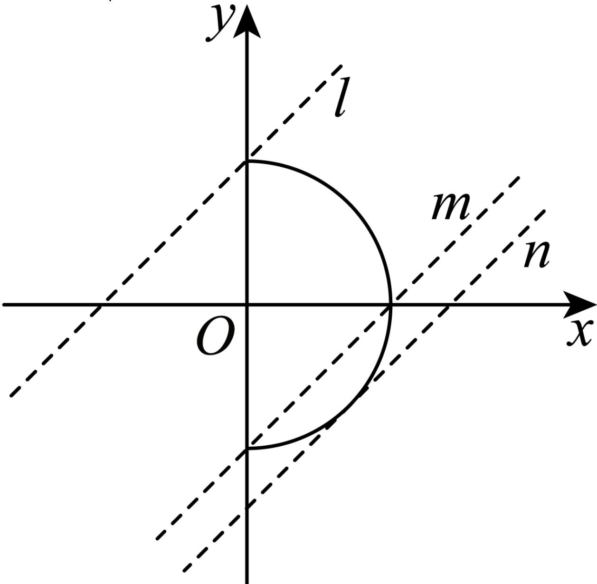

> [!faq]- 2024-2025学年内蒙古包头九十七中高二（上）期中数学试卷解析
>
> > [!success]- **【答案】** C
>
> > [!note]- **【解析】**
> > 直线 $y = x + b$ 与曲线 $x = \sqrt{1 - y^2}$ 恰有一个公共点，
> >
> > 将表达式 $x = \sqrt{1 - y^2}$ 两边平方整理可得 $x^{2} + y^{2} = 1(x\geqslant 0)$
> >
> > 即可得曲线 $x = \sqrt{1 - y^2}$ 表示的是以圆心为 $(0,0)$ ，半径为1的右半圆，如下图所示：
> >
> > 
> >
> > 易知当直线 $y = x + b$ 夹在直线 $l$ ， $m$ 之间时符合题意；
> >
> > 当 $y=x+b$ 在l位置时，此时b=1，
> >
> > 当 $y = x + b$ 在 $m$ 位置时，此时 $b = -1$ ，此时直线于曲线有两个交点，
> >
> > 因此可得 $b \in (-1, 1]$ 时，符合题意；
> >
> > 当 $y=x+b$ 在n位置时，此时直线与半圆相切且b<-1，
> >
> > 即 $\frac{|b|}{\sqrt{1 + 1}} = 1$ ，解得 $b = -\sqrt{2}$
> >
> > 综上可得实数b的取值范围为 $(-1,1]\cup\{-\sqrt{2}\}$ .
> >
> > ## 故选：C.
