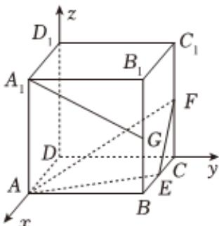
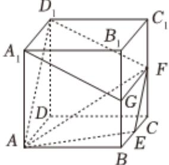

> [!faq]- 2024-2025学年内蒙古包头九十七中高二（上）期中数学试卷解析
>
> > [!success]- **【答案】** ACD
>
> > [!note]- **【解析】**
> > 在棱长为1的正方体 $ABCD - A_{1}B_{1}C_{1}D_{1}$ 中，建立 $D$ 以为原点，
> >
> > 如图所示：
> >
> > 以 $DA, DC, DD_{1}$ 所在的直线为 $x$ 轴、 $y$ 轴、 $z$ 轴的空间直角坐标系 $D - xyz$
> >
> > 
> >
> > 因为 $E$ 、 $F$ 、 $G$ 分别为 $BC$ 、 $CC_{1}$ 、 $BB_{1}$ 的中点，
> >
> > 则 $D(0,0,0)$ 、 $D_{1}(0,0,1)$ 、 $A(1,0,0)$ 、 $F(0,1,\frac{1}{2})$
> >
> > 对于 $A, A_{1}(1,0,1), G(1,1, \frac{1}{2}), \overrightarrow{A_{1}G} = (0,1, -\frac{1}{2}), \overrightarrow{DD_{1}} = (0,0,1)$
> >
> > 设直线 $A_{1}G$ 与直线 $D_{1}D$ 所成角为 $\theta$ ，
> >
> > 所以 $cos\theta=|cos<\overrightarrow{A_{1}G},\overrightarrow{DD_{1}}>|\frac{|\overrightarrow{A_{1}G}\bullet\overrightarrow{DD_{1}}|}{|\overrightarrow{A_{1}G}|\bullet|\overrightarrow{DD_{1}}|}=\frac{\frac{1}{2}}{\sqrt{1+\frac{1}{4}}}=\frac{\sqrt{5}}{5}$ ，故A正确；
> >
> > 对于 $B, \overrightarrow{AD_1} = (-1, 0, 1), \overrightarrow{AF} = (-1, 1, \frac{1}{2})$
> >
> > 所以 $\overrightarrow{AD_1} \bullet \overrightarrow{AF} = \frac{3}{2}$ , $|A_1D| = \sqrt{2}$ , $|AF| = \frac{3}{2}$ ,
> >
> > 所以 $cos\angle D_{1}AF=\frac{1.5}{\sqrt{2}\times1.5}=\frac{\sqrt{2}}{2}$ ，
> >
> > 所以点 $D_{1}$ 到 $AF$ 距离为 $\pmb{d} = \sqrt{2} \times \sin \angle D_{1} AF = 1$ ，故 $B$ 错误；对于 $C$ ，连接 $AD_{1}$ 、 $FD_{1}$ ， $FG$ ，
> >
> > 
> >
> > 在正方体中，因为 $F$ 、 $G$ 分别为 $CC_{1}$ 、 $BB_{1}$ 的中点，则 $BC_{1} / / EF$ ，
> >
> > 又易得 $AD_{1} \parallel BC_{1}$ ，所以 $AD_{1} \parallel EF$ ，故A、 $D_{1}$ 、E、F四点共面，
> >
> > 又因为 $A_{1}D_{1} / / GF$ 且 $A_{1}D_{1} = GF$ ，所以四边形 $AD_{1}FG$ 为平行四边形，
> >
> > 所以 $A_{1}G \parallel D_{1}F$ ，又 $A_{1}G \notin$ 平面 $AEF, D_{1}F \subset$ 平面 $AEF$
> >
> > 所以 $A_{1}G$ // 平面AEF，故C正确；
> >
> > 对于D，因为 $A_{1}G$ //平面AEF，
> >
> > $\therefore V_{A_1 - AEF} = V_{G - AEF} = V_{A - EFG} = \frac{1}{3}\times \frac{1}{2}\times 1\times \frac{1}{2}\times 1 = \frac{1}{12}$ ，故 $D$ 正确
> >
> > 故选：ACD.
