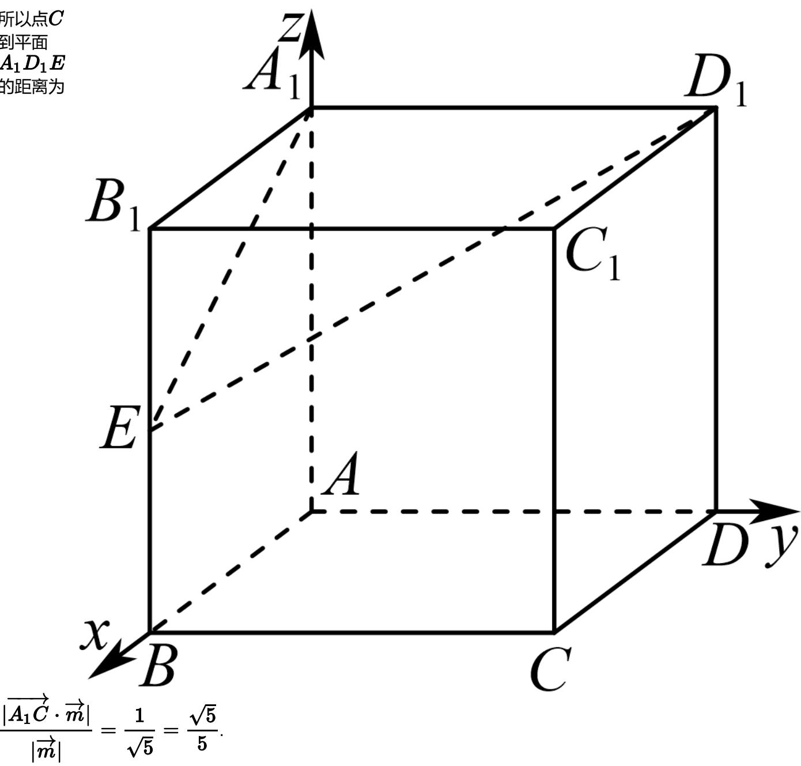

> [!faq]- 2024-2025学年内蒙古包头九十七中高二（上）期中数学试卷解析
>
> > [!success]- **【答案】** $\frac{\sqrt{5}}{5}$
>
> > [!note]- **【解析】**
> > 以 $A$ 为原点， $AB$ ， $AD$ ， $AA_{1}$ 所在直线分别为 $x$ ， $y$ ， $z$ 轴，建立如图所示的空间直角坐标系，则 $A_{1}(0,0,\ldots,D_{1}(0,1,\ldots,E(1,0,\ldots,C(1,1,\ldots)$
> >
> > 1) 1) $\frac{1}{2})$ 0) 所以 $\overrightarrow{A_1D_1}$ ， $\overrightarrow{A_1E}$ ， $\overrightarrow{A_1C}$ $= (0,1 = (1,0, = (1,1,$ ，0） $-\frac{1}{2})$ -1）
> >
> > 设平面 $A_{1}D_{1}E$ 的法向量为 $\overrightarrow{m} = (x_1$ ，则 $\left\{ \begin{array}{l}y_{1} = 0\\ x_{1}\\ -\frac{1}{2} z_{1} = 0 \end{array} \right.$ 取 $z_{1} = 2$ ，则 $\overrightarrow{m} = (1,$ ，，0，2）
> >
> > 所以点C到平面 $A_{1}D_{1}E$ 的距离为
> >
> > 
> >
> > 故答案为： $\frac{\sqrt{5}}{5}$ .
