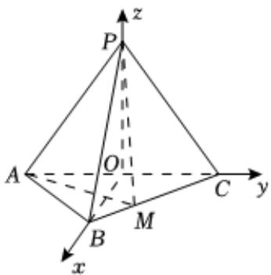

> [!faq]- 2024-2025学年内蒙古包头九十七中高二（上）期中数学试卷解析
>
> > [!success]- **【答案】** 详见解析
>
> > [!note]- **【解析】**
> > 详见解析
> >
> > ∴ $k_{AB} = \frac{1 - (-2)}{1 - 2} = -3$ ∴弦AB的垂直平分线的斜率为 $\frac{1}{3}$
> >
> > 又弦AB的中点坐标为 $\left(\frac{3}{2},-\frac{1}{2}\right)$ ,
> > ∴弦AB的垂直平分线的方程为 $y+\frac{1}{2}=\frac{1}{3}(x-\frac{3}{2})$ ，即x-3y-3=0，
> > 与直线l:x-y+1=0联立，解得：x=-3,y=-2，
> > ∴圆心C坐标为 $(-3,-2)$ ,
> > ∴圆的半径 $r=|AC|=5$ 则圆C的方程为 $(x+3)^{2}+(y+2)^{2}=25$ ;
> > (2)设 $Q(x_{1},y_{1})$ ，线段PQ的中点M为 $(x,y)$ .
> > 则 $x_{1}=2x-5,y_{1}=2y①$ .
> > ∵端点Q在圆 $(x+3)^{2}+(y+2)^{2}=25$ 上运动，
> > ∴ $(x_{1}+3)^{2}+(y_{1}+2)^{2}=25$ .
> > 把①代入得： $(2x-5+3)^{2}+(2y+2)^{2}=25$ .
> > ∴线段PQ的中点M的轨迹方程是 $(x-1)^{2}+(y+1)^{2}=\frac{25}{4}$ .
> >
> > 
