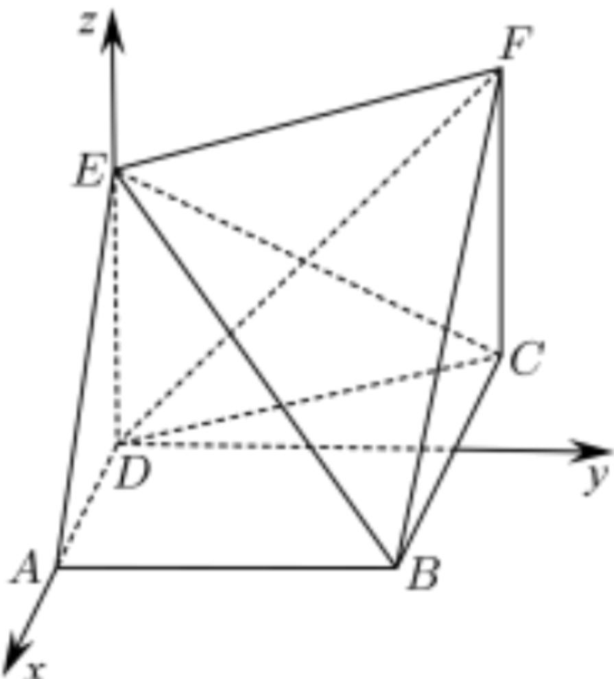

> [!faq]- 2024-2025学年内蒙古包头九十七中高二（上）期中数学试卷解析
>
> > [!success]- **【答案】** 详见解析
>
> > [!note]- **【解析】**
> > 详见解析
> >
> > (1)证明：由题易知 $DE \perp CD$ ，
> >
> > 又面EDCF⊥面ABCD，面EDCF∩面ABCD = CD，DE⊂面EDCF，所以ED⊥面ABCD，
> >
> > 建立空间直角坐标系，如下图所示：
> >
> > 
> >
> > $D(0,0,0), A(1,0,0), B(1,2,0), C(-1,2,0), E(0,0,2), F(-1,2,2)$ 设平面 $ABE$ 的一个法向量 $\overrightarrow{m} = (x, y, z)$ ，  
> > 因为 $\overrightarrow{BE} = (-1, -2, 2), \overrightarrow{AB} = (0, 2, 0)$ ，  
> > 由 $\left\{ \begin{array}{l} \overrightarrow{m} \cdot \overrightarrow{BE} = -x - 2y + 2z = 0 \\ \overrightarrow{m} \cdot \overrightarrow{AB} = 2y = 0 \end{array} \right.$ ，取 $z = 1$ ，则 $\overrightarrow{m} = (2, 0, 1)$ ，  
> > 又 $\overrightarrow{DF} = (-1, 2, 2)$ ，故可以得到 $\overrightarrow{DF} \cdot \overrightarrow{m} = -2 + 0 + 2 = 0$ ，则 $\overrightarrow{DF} \perp \overrightarrow{m}$ ，又 $DF\not\subset$ 面 $ABE$ ，所以 $DF / /$ 面 $ABE$ ；  
> > (2)由点 $P$ 在线段 $EF$ 上，设 $\overrightarrow{EP} = \lambda \overrightarrow{EF}, \lambda \in [0, 1]$ ， $\overrightarrow{AP} = \overrightarrow{AE} + \lambda \overrightarrow{EF} = (-1, 0, 2) + \lambda (-1, 2, 0) = (-1 - \lambda, 2\lambda, 2)$ ，  
> > 设平面 $BEF$ 的一个法向量 $\overrightarrow{n} = (x_1, y_1, z_1)$ ， $\overrightarrow{BE} = (-1, -2, 2), \overrightarrow{EF} = (-1, 2, 0)$ ，  
> > 由 $\left\{ \begin{array}{l} \overrightarrow{n} \cdot \overrightarrow{BE} = -x_1 - 2y_1 + 2z_1 = 0 \\ \overrightarrow{n} \cdot \overrightarrow{EF} = -x_1 + 2y_1 = 0 \end{array} \right.$ ，取 $y_1 = 1$ ，可得 $\overrightarrow{n} = (2, 1, 2)$ ，  
> > 设直线 $AP$ 与平面 $BEF$ 所成角为 $\theta$ ，
> >
> > $$
> > \text {则} \sin \theta = | \cos <   \overrightarrow {A P}, \overrightarrow {n} > | = | \frac {\overrightarrow {A P} \cdot \overrightarrow {n}}{| \overrightarrow {A P} | | \overrightarrow {n} |} | = | \frac {2 (- 1 - \lambda) + 2 \lambda + 4}{3 \sqrt {(- \lambda - 1) ^ {2} + 4 \lambda^ {2} + 4}} | = \frac {\sqrt {1 4}}{1 4},
> > $$
> >
> > 所以 $45\lambda^{2}+18\lambda-11=0$ ，即 $(3\lambda-1)(15\lambda+11)=0$ ，
> >
> > 因为 $\lambda \in [0,1]$ ，所以 $\lambda = \frac{1}{3}$ ，所以 $\frac{EP}{EF} = \frac{1}{3}$
