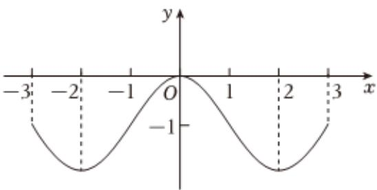

<!-- question-source:start -->
3、已知函数 $f(x)$ 的图象如图所示，不等式 $xf'(x) > 0$ 的解集是（）
A $(-3,-2)\cup(0,2)$ B $(-3,-2)\cup(2,3)$ C $(-2,0)\cup(0,2)$ D $(-2,0)\cup(2,3)$

<!-- question-source:end -->

![[Q00090730A1]]
