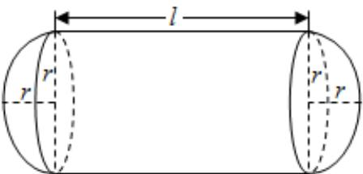

<!-- question-source:start -->
2、

某企业拟建造如图所示的容器（不计厚度，长度单位：米），其中容器的中间为圆柱形，左右两端均为半球形，按照设计要求容器的容积为 $\frac{80\pi}{3}$ 立方米，且 $l \geqslant 2r$ . 假设该容器的建造费用仅与其表面积有关. 已知圆柱形部分每平方米建造费用为3千元，半球形部分每平方米建造费用为4千元. 设该容器的建造费用为y千元.

1 写出 $y$ 关于 $r$ 的函数表达式，并求该函数的定义域；

2 求该容器的建造费用最小时的r值，并求出最小值.
<!-- question-source:end -->

![[Q00090743A1]]
