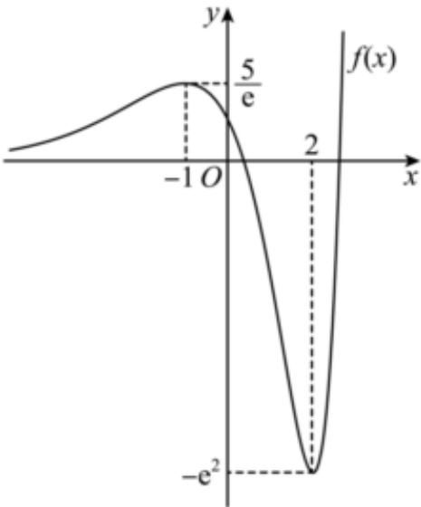

> [!faq]- 2024-2025学年内蒙古包头九十三中高二（下）月考数学试卷（3月份）解析
>
> > [!success]- **【答案】** AC
>
> > [!note]- **【解析】**
> > $\because f(x)$ 定义域为 $R$ ， $f^{\prime}(x) = (x^{2} - x - 2)e^{x} = (x - 2)(x + 1)e$ $\therefore$ 当 $x\in (-\infty , - 1)\cup (2, + \infty)$ 时， $f^{\prime}(x) > 0$ ；当 $x\in (-1,2)$ 时， $f^{\prime}(x) <   0$ $\therefore f(x)$ 在 $(- \infty , - 1)$ ， $(2, + \infty)$ 上单调递增，在 $(-1,2)$ 上单调递减， $\therefore f(x)$ 极大值为 $f(-1) = \frac{5}{e}$ ，极小值为 $f(2) = -e^2$ 当 $x <   0$ 时， $x^{2} - 3x + 1 > 0$ ， $e^x >0$ ， $\therefore f(x) > 0$ 恒成立；  
> > 可作出 $f(x)$ 图象如图所示，  
> > 对于 $A$ ， $f(x)$ 的极大值点为 $x = -1$ ，极小值点为 $x = 2$ ， $A$ 正确；  
> > 对于 $B$ ， $f(-1)$ 不是 $f(x)$ 的最小值， $B$ 错误；  
> > 对于 $C$ ， $f(x)$ 在 $x = 2$ 处取得极小值， $C$ 正确；  
> > 对于 $D$ ，由图象可知， $f(x)$ 有且仅有两个不同的零点， $D$ 错误.  
> > 故选：AC.
> >
> > 
