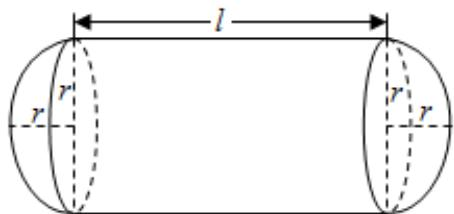

> [!faq]- 2024-2025学年内蒙古包头九十三中高二（下）月考数学试卷（3月份）解析
>
> > [!success]- **【答案】** 详见解析
>
> > [!note]- **【解析】**
> > 详见解析
> >
> > （I）由题意可得， $\pi r^{2}l+\frac{4\pi}{3}r^{3}=\frac{80}{3}\pi(l\geqslant2r)$
> >
> > 解得 $l = \frac{80}{3r^2} -\frac{4}{3} r\geqslant 2r$ ，则 $0 <   r\leqslant 2$
> >
> > 所以容器的建造费用为
> >
> > 
> >
> > $$
> > y = 2 \pi r l \times 3 + 4 \pi r ^ {2} \times 4 = 6 \pi r \left(\frac {8 0}{3 r ^ {2}} - \frac {4}{3} r\right) + 1 6 \pi r ^ {2},
> > $$
> >
> > 故 $y=\frac{160\pi}{r}+8\pi r^{2}$ ，定义域为 $\{r\mid0<r\leqslant2\}$ ;
> >
> > （Ⅱ）因为 $y' = -\frac{160\pi}{r^2} + 16\pi r = \frac{16\pi r^3 - 160\pi}{r^2}$
> >
> > 令 $y' = 0$ ，得 $r = \sqrt[3]{10}$ ，
> >
> > 又 $r=\sqrt[3]{10}>2$
> >
> > 当 $0 < r \leqslant 2$ 时， $y' < 0$ ，函数y为减函数，
> >
> > 故当 $r = 2$ 时， $y$ 有最小值，此时 $y_{\mathrm{min}} = 112\pi$
> >
> > 答：该容器的建造费用最小时的半径为2米，最小值 $112\pi$ 千元.
