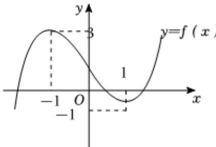

> [!faq]- 2024-2025学年内蒙古包头九十三中（北重三中）高二（下）期中数学试卷解析
>
> > [!success]- **【答案】** D
>
> > [!note]- **【解析】**
> > 对于 $A$ ， $f^{\prime}(x) = 3x^{2} - 3 = 3(x + 1)(x - 1)$ 令 $f^{\prime}(x) = 0$ ，则 $x_{1} = -1$ ， $x_{2} = 1$
> >
> > 且 $f(-1)=3$ ， $f(1)=-1$ ，对应点为 $(-1,3)$ ， $(1,-1)$ ，因为 $\left(\frac{-1+1}{2},\frac{3+(-1)}{2}\right)=(0,1)$ ，
> >
> > 所以 $(-1,3)$ ， $(1,-1)$ 关于 $(0,1)$ 点对称，故 $A$ 正确；
> >
> > 对于 $B$ ，因为 $f^{\prime}(x) = 3(x + 1)(x - 1)$ ，所以当 $-1 < x < 1$ 时， $f^{\prime}(x) < 0$ ，所以 $f(x)$ 在 $(-1,1)$ 上单调递减，
> >
> > 当 $x > 1$ 或 $x < -1$ 时， $f'(x) > 0$ ，所以 $f(x)$ 在 $(-1, 1)$ 上单调递增，
> >
> > 且 $f(-1) = 3$ ， $f(1) = -1$ ，画出简图为
> >
> > 
> >
> > 结合图象知， $f(x)=m$ 有一解，则m>3或m<-1，故B错误；
> >
> > 对于 $C$ ，结合图象， $\pmb {x} = 1$ 为极小值点，
> >
> > 所以 $y = f(x)$ 在 $[-2, n)$ 上有极小值，则 $n > 1$ ，故 $C$ 正确；
> >
> > 对于 $D$ ，令 $\pmb {f}(\pmb {x}) = \pmb{x}^3 -3\pmb {x} + 1 = 3$ ，则 $\pmb {x} = -1$ 或2，
> >
> > 结合图象知， $y = f(x)$ 在 $[-2, n)$ 上有最大值3，则 $n \in (-1, 2]$ ，故D正确，
> >
> > $$
> > A C D
> > $$
