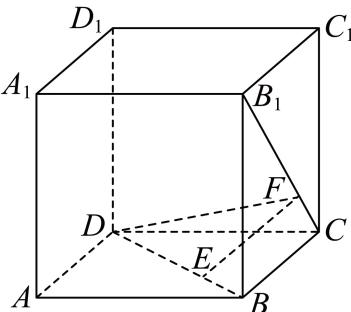

<!-- question-source:start -->
7、已知和两条异面直线都垂直相交的直线叫做两条异面直线的公垂线，公垂线与两条直线相交的点所形成的线段，叫做这两条异面直线的公垂线段。两条异面直线的公垂线段的长度，叫做这两条异面直线的距离。如图，在棱长为1的正方体 $ABCD-A_{1}B_{1}C_{1}D_{1}$ 中，点E在BD上，且 $BE=\frac{1}{3}BD$ ；点F在 $CB_{1}$ 上，且 $CF=\frac{1}{3}CB_{1}$ 。则下列结论错误的是（）

A 线段EF是异面直线BD与 $CB_{1}$ 的公垂线段

B 异面直线 $AA_{1}$ 与BD的距离为 $\frac{1}{2}$ C 点 $D_{1}$ 到直线EF的距离为 $\frac{\sqrt{14}}{3}$

D 点 $D_{1}$ 到平面DEF的距离为 $\frac{\sqrt{6}}{3}$
<!-- question-source:end -->

![[Q00090753A1]]
