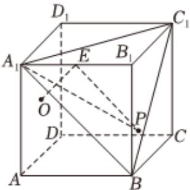

<!-- question-source:start -->
4、如图，P是棱长为1的正方体ABCD-A\_{1}B\_{1}C\_{1}D\_{1}的表面上一个动点，E为棱A\_{1}B\_{1}的中点，O为侧面ADD\_{1}A\_{1}的中心.下列结论正确的是（）

A $OE \perp$ 平面 $A_{1}BC_{1}$ B $AB$ 与平面 $A_{1}BC_{1}$ 所成角的余弦值为 $\frac{\sqrt{3}}{3}$ C 若点 $P$ 在各棱上，且到平面 $A_{1}BC_{1}$ 的距离为 $\frac{\sqrt{3}}{6}$ ，则满足条件的点 $P$ 有9个  
D  
若点 $P$ 在侧面 $BCC_{1}B_{1}$ 内运动，且满足 $|PE| = 1$ ，则 $P$ 点的轨迹（符合条件的动点所形成的图形）长度为 $\sqrt{3}\pi$
<!-- question-source:end -->

![[Q00090758A1]]
