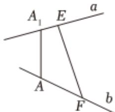

<!-- question-source:start -->
3、如图，两条异面直线a，b所成的角为 $60^{\circ}$ ，在直线a，b上分别取点 $A_{1}$ ，E和点A，F，使 $A_{1}A\perp a$ ， $A_{1}A\perp b$ ，已知 $A_{1}E=1$ ，AF=2，EF=3，则 $|AA_{1}|=$ \_\_\_\_.

<!-- question-source:end -->

![[Q00090761A1]]
