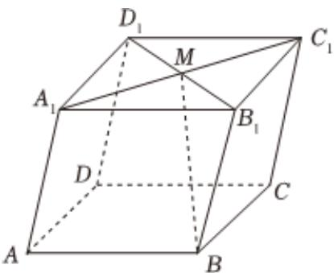

<!-- question-source:start -->
1、

如图，平行六面体 $ABCD - A_1B_1C_1D_1$ 中，以顶点 $\pmb{A}$ 为端点的三条棱长都是1， $\angle BAD = 90^{\circ}$ ， $\angle DAA_{1} = \angle BAA_{1} = 60^{\circ}$ ， $M$ 为 $A_{1}C_{1}$ 与 $B_{1}D_{1}$ 的交点.设 $\overrightarrow{AB} = \overrightarrow{a}$ ， $\overrightarrow{AD} = \overrightarrow{b}$ ， $\overrightarrow{AA_{1}} = \overrightarrow{c}$ .

1 用 $\overrightarrow{a}$ , $\overrightarrow{b}$ , $\overrightarrow{c}$ 表示 $\overrightarrow{BM}$ , 并求 $|\overrightarrow{BM}|$ 的值;

2 求 $\overrightarrow{BM} \cdot \overrightarrow{AC_{1}}$ 的值.
<!-- question-source:end -->

![[Q00090763A1]]
