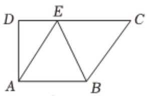
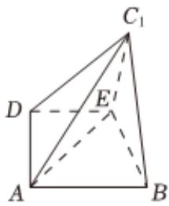

<!-- question-source:start -->
5、

图①是直角梯形ABCD, AB//CD, $\angle D = 90^{\circ}$ ，四边形ABCE 是边长为2的菱形，并且 $\angle BCE = 60^{\circ}$ ，以BE为折痕将 $\triangle BCE$ 折起，使点C到达 $C_{1}$ 的位置，且 $AC_{1} = \sqrt{6}$ .

1 求证：平面 $BC_{1}E \perp$ 平面ABED；

2

在棱 $DC_{1}$ 上是否存在点 $P$ ，使得点 $P$ 到平面 $ABC_{1}$ 的距离为 $\frac{\sqrt{15}}{5}$ ？若存在，求出直线 $EP$ 与平面 $ABC_{1}$ 所成角的正弦值；若不存在，请说明理由.
<!-- question-source:end -->

![[Q00090767A1]]
