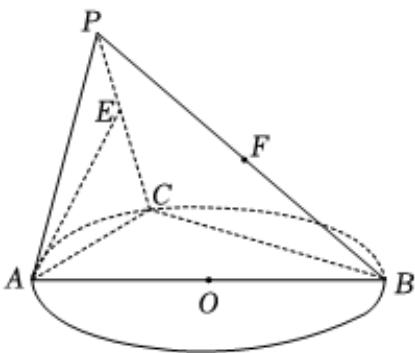

<!-- question-source:start -->
6、

如图，C是以AB为直径的圆O上异于A，B的点，平面PAC⊥平面ABC，△PAC为正三角形，E，F分别是PC，PB上的动点.

1 求证： $BC \perp AE$ ;

2

若 $E$ ， $F$ 分别是 $PC$ ， $PB$ 的中点且异面直线 $AF$ 与 $BC$ 所成角的正切值为 $\frac{\sqrt{3}}{2}$ ，记平面 $AEF$ 与平面 $ABC$ 的交线为直线 $l$ ，点 $Q$ 为直线 $l$ 上动点，求直线 $PQ$ 与平面 $AEF$ 所成角的取值范围.
<!-- question-source:end -->

![[Q00090768A1]]
