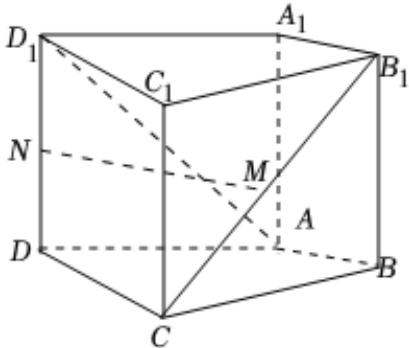

<!-- question-source:start -->
3. 如图，在四棱柱 $ABCD - A_{1}B_{1}C_{1}D_{1}$ 中，侧棱 $AA_{1}\perp$ 底面 $ABCD$ ， $AB\perp AC$ ， $AB = 1$ ， $AC = AA_{1} = 2$ ， $AD = CD = \sqrt{5}$ ，且点 $M$ 和 $N$ 分别为 $B_{1}C$ 和 $D_{1}D$ 的中点.请用空间向量知识解答下列问题：

1 求证：MN//平面ABCD；

2 求平面 $ACD_{1}$ 与平面 $ACB_{1}$ 夹角的余弦值.
<!-- question-source:end -->

![[Q00092258A1]]
