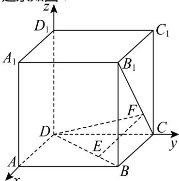

> [!faq]- 2024-2025学年内蒙古包头九十五中高二（上）月考数学试卷（10月份）解析
>
> > [!success]- **【答案】** B
>
> > [!note]- **【解析】**
> > 建系如图：
> >
> > 
> >
> > $$
> > D (0, 0, 0), A (1, 0, 0), B (1, 1, 0), C (0, 1, 0), A _ {1} (1, 0, 1), B _ {1} (1, 1, 1), D _ {1} (0, 0, 1)
> > $$
> >
> > $$
> > \overrightarrow {C F} = \frac {1}{3} \overrightarrow {C B _ {1}} = (\frac {1}{3}, 0, \frac {1}{3}), \overrightarrow {E B} = \frac {1}{3} \overrightarrow {D B} = (\frac {1}{3}, \frac {1}{3}, 0)
> > $$
> >
> > 可得 $E\left(\frac{2}{3}, \frac{2}{3}, 0\right), F\left(\frac{1}{3}, 1, \frac{1}{3}\right)$
> >
> > 对于A选项，易知 $\overrightarrow{EF}=\left(-\frac{1}{3},\frac{1}{3},\frac{1}{3}\right),\overrightarrow{DB}=\left(1,1,0\right),\overrightarrow{CB_{1}}=\left(1,0,1\right)$
> >
> > 易知 $\overrightarrow{EF} \cdot \overrightarrow{DB} = -\frac{1}{3} + \frac{1}{3} = 0, \overrightarrow{EF} \cdot \overrightarrow{CB_1} = -\frac{1}{3} + \frac{1}{3} = 0$ ，即 $EF \perp DB, EF \perp CB_1$
> >
> > 根据定义可知线段 $EF$ 是异面直线 $BD$ 与 $CB_{1}$ 的公垂线段，所以 $\mathbf{A}$ 选项正确；
> >
> > 对于B选项，因为四边形ABCD为正方形，则AC⊥BD
> >
> > 因为 $AA_{1}\perp$ 平面ABCD，AC⊂平面ABCD，则 $AC\perp AA_{1}$
> >
> > 所以异面直线 $AA_{1}$ 与BD的公垂线的一个方向向量为 $\overrightarrow{AC} = (-1, 1, 0)$ ,
> >
> > 又 $\overrightarrow{DA}=(1,0,0)$ ,
> >
> > 所以异面直线 $AA_{1}$ 与BD的距离为 $\frac{|\overrightarrow{AC}\cdot\overrightarrow{DA}|}{|\overrightarrow{AC}|}=\frac{1}{\sqrt{2}}=\frac{\sqrt{2}}{2}$ ，所以B选项错误；
> >
> > 对于 $C$ 选项，因为 $\overrightarrow{EF} = (-\frac{1}{3}, \frac{1}{3}, \frac{1}{3}), \overrightarrow{D_1E} = (\frac{2}{3}, \frac{2}{3}, -1)$ ，
> >
> > 所以 $\frac{|\overrightarrow{D_1E} \cdot \overrightarrow{EF}|}{|\overrightarrow{EF}|} = \frac{\sqrt{3}}{3}$ ；
> >
> > 所以点 $D_{1}$ 到直线 $EF$ 的距离为 $\pmb{d} = \sqrt{\left|\overrightarrow{D_1E}\right|^2 - \left(\frac{\sqrt{3}}{3}\right)^2} = \frac{\sqrt{14}}{3}$ ，所以 $C$ 选项正确；
> >
> > 对于D选项，设平面DEF的一个法向量为 $\overrightarrow{n}=(x,y,z)$ ，
> >
> > 则 $\left\{ \begin{array}{l} \overrightarrow{n} \cdot \overrightarrow{DB} = x + y = 0 \\ \overrightarrow{n} \cdot \overrightarrow{DF} = \frac{1}{3} x + y + \frac{1}{3} z = 0 \end{array} \right.$ ，取 $\overrightarrow{n} = (1, -1, 2)$ ，又 $\overrightarrow{DD_1} = (0, 0, 1)$ ，
> >
> > 所以点 $D_{1}$ 到平面 $DEF$ 的距离为 $\pmb{d} = \frac{|\overrightarrow{n} \cdot \overrightarrow{DD_1}|}{|\overrightarrow{n}|} = \frac{2}{\sqrt{1 + 1 + 4}} = \frac{\sqrt{6}}{3}$ ，所以 $D$ 选项正确.
> >
> > 故选：B.
