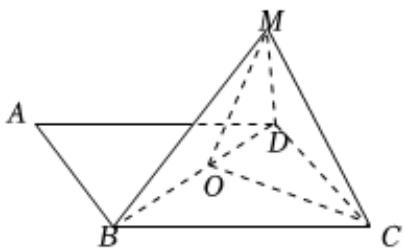

> [!faq]- 2024-2025学年内蒙古包头九十五中高二（上）月考数学试卷（10月份）解析
>
> > [!success]- **【答案】** C
>
> > [!note]- **【解析】**
> > 对于 $A$ ，菱形ABCD中， $\angle BAD = 60^{\circ}$ ，AC与BD相交于点O，将
> >
> > $\triangle ABD$ 沿 $BD$ 折起，使顶点 $\mathbf{A}$ 至点 $\mathbf{M}$
> >
> > 如图所示，连接MO，OC，可知 $MO \perp BD$ ， $OC \perp BD$ ，
> >
> > $$
> > M O \cap O C = O
> > $$
> >
> > 所以 $BD \perp$ 平面MCO，而 $MC \subset$ 面MCO，可知 $MC \perp BD$ ，故A正确；
> >
> > 对于 $B$ ，由题意 $AB = BC = CD = DA = BD$ ，三棱锥 $O - CDM$ 是
> >
> > 
> >
> > 正四面体时，易知 $\triangle CDM$ 为等边三角形，故 $B$ 正确；
> >
> > 对于 $C$ ，三棱锥 $M - BDC$ 是正四面体时， $DM$ 与 $BC$ 垂直，故 $C$ 不正确；
> >
> > 对于D，平面BDM与平面BDC垂直时，直线DM与平面BCD所成的角的最大值为 $60^{\circ}$ ，故D正确.
> >
> > 故选：C.
