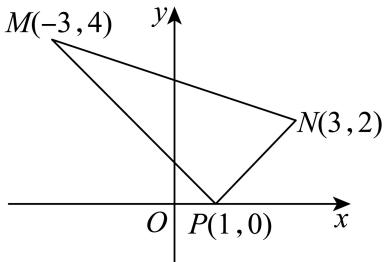

> [!faq]- 2024-2025学年内蒙古包头九十五中高二（上）月考数学试卷（10月份）解析
>
> > [!success]- **【答案】** AC
>
> > [!note]- **【解析】**
> > 对于 $A$ 选项，若 $A(-2,3)$ 、 $B(3, - 2)$ 、 $C(1,m)$ 三点共线，
> >
> > 意味着直线 $AB$ ， $AC$ 重合，此时 $\pmb{k}_{AB} = \pmb{k}_{AC}$
> >
> > 根据两点斜率公式可得 $\frac{3 - (-2)}{-2 - 3} = \frac{m - 3}{1 - (-2)}$ ，解得 $m = 0$ ，故 $A$ 选项正确；
> >
> > 对于B选项，当直线经过原点和(3,2)时，方程为 $y=\frac{2}{3}x$ ，
> >
> > 在横纵坐标上截距都是0，也互为相反数，符合题意，答案不完整，故B选项错误；
> >
> > 对于 $C$ 选项，已知两点 $M(-3,4)$ 、 $N(3,2)$ ，过点 $P(1,0)$ 的直线 $l_{1}$ 与线段 $MN$ 有公共点，
> >
> > 如图， $k_{PN} = \frac{2 - 0}{3 - 1} = 1$ ， $k_{PM} = \frac{4 - 0}{-3 - 1} = -1$
> >
> > 于是结合图形可知， $k$ 的取值范围为 $(-\infty , - 1]\cup [1, + \infty)$ ，故 $C$ 选项正确；
> >
> > 
> >
> > 对于 $D$ 选项，先求得 $l_{3}: x + 3y - 10 = 0$ 和直线 $l_{4}: 3x - y = 0$ 的交点为 $(1,3)$ ，
> >
> > 当直线斜率不存在时， $x = 1$ ，显然和原点距离是1；
> >
> > 当斜率存在时，设 $y - 3 = k(x - 1)$ ，由原点到直线的距离公式可得 $\frac{|3 - k|}{\sqrt{k^2 + 1}} = 1$ ，解得 $k=\frac{4}{3}$ ，即符合题意的直线有x=1， $y=\frac{4}{3}x+\frac{5}{3}$ ，共两条，故D选项错误.
> > 故选：AC.
